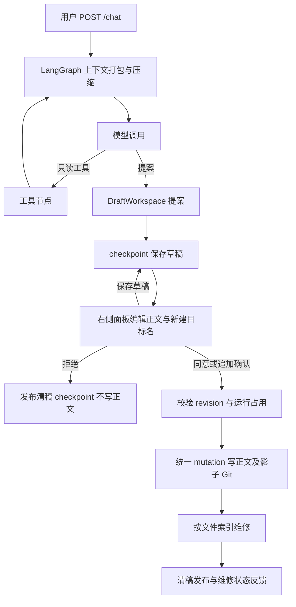

# 聊天工具（现行契约）

> 以代码为准。描述 Agent 四个 `@tool`、何时调用、参数与返回、以及人审后如何落盘。执行装配见 [architecture.md](../01-architecture/architecture.md)，人审与恢复见 [recovery.md](../03-modules/recovery/recovery.md)。\
> 工具 hop、stub 截断、Runtime vs Persistent 见 [context-management.md](../03-modules/chat/context-management.md)。\
> 切块、Chroma 点、审批后同步见 [retrieval.md](../03-modules/retrieval/retrieval.md)。

> 关联文档：行为门与判定口径 [evals/prompt/README.md](../../evals/prompt/README.md)；生成提示词准则 [note-quality.md](../../evals/criteria/note-quality.md)；工具使用问题的取证见 [rag-v1-report.md](../../evals/reports/rag-v1-report.md) §4。

| 项 | 内容 |
|---|---|
| 装配 | [`build_chat_tools`](../../src/noteagent/chat/tools.py) → `ChatAgent` `bind_tools` |
| 落盘 | 正式审批经 `ChatAgent.review` → `NoteMutationService`；commit_review 仅兼容路径，工具不写 notes |
| 意图门 | [`prompts/system.txt`](../../src/noteagent/chat/prompts/system.txt) Task；无单独分类器服务 |

---

## 1. 范围与原则

四个工具：`list_files`、`read_file`、`search_relative_from_chromadb`、`propose_note`。

- LLM 只出提案或问答；禁止在回复里声称已经写入或删除文件。
- `list_files` / `read_file` / `search_relative_from_chromadb` **只读**。
- `propose_note` 在 graph 工具节点的 DraftWorkspace 中生成提案，再保存为 checkpoint 的 pending_draft；不写正文或 Chroma。
- 正式审批由 ChatAgent.review 和 ConversationService 校验运行占用及版本，走统一 NoteMutationService 记录前像、写盘、影子 Git 与索引维修，清稿发布前保留 approval 维护记录。
- 索引由 IndexRepairService 按文件维修，检索校验正文哈希和当前索引配置，拒绝陈旧片段。故障与重启处理见 recovery.md；不能把正文已写当作索引已完成。

路径规则在 [`FileNoteRepository._resolve`](../../src/noteagent/notes/repository.py)：拒绝空名、绝对路径、`..`、两层以上目录；允许一层 `Folder/Note.md`。工具侧把异常收成 `{error: str}`。

---

## 2. 工作流

图执行节点见 chat/session.py 和 chat/nodes.py。完整 UI 历史与压缩工作上下文分别保存；工具存根作为助手的 tool_steps 展示，不读旧消息表作为正式状态。每次模型调用前打包上下文，必要时压缩；max_tool_hops 限制保持不变。工具节点在 DraftWorkspace 中执行提案并在继续模型调用前持久保存。

---

## 3. 何时调用

写在 `system.txt` Task，实现时不要另做隐藏分类器。

| 用户本句 | 工具 | 禁止 |
|----------|------|------|
| 闲聊、寒暄、与笔记无关的问答 | 不调 `propose_note` | 提案 |
| 问以前学过什么、笔记里怎么写的 | 先 `search_relative_from_chromadb`，必要时 `read_file` | 编造旧笔记；顺便提案 |
| 只贴长文/外文，没说要记、翻译、润色、摘要或抽取 | 一两句话问要做什么 | 因材料长而自动提案 |
| 已说明要记下来 / 翻译 / 润色 / 摘要 / 只保留某部分 | 必须先 `list_files`；可能撞车时 `read_file` 或 search；相近文件则 `propose_note(append)`，否则 `create` | 把「再记一笔」做成 `replace` |
| 明确更正、覆盖、改掉已有过时/错误表述 | 先 `list_files`，再 `read_file` 全文，然后 `propose_note(replace)`；content 为完整文件（含原有一级标题） | 不读就覆盖；只交改动的几行 |
| 明确删除某篇笔记文件 | 先 `list_files` 确认文件名，必要时 `read_file`，然后 `propose_note(delete)`；content 可空 | 未确认文件名就删 |

提案成功后助手回复一两句「草稿已生成并待你审批」，不粘贴完整草稿（正文在右侧引用面板的草稿模式里显示和编辑）。

---

## 4. 四工具契约

均由 `build_chat_tools(notes, retrieval, drafts)` 闭包捕获依赖。异常普遍变成 `{error: str}`，不抛给模型循环（循环里另有一层 try，见 agent）。

### 4.1 `list_files`

| | |
|--|--|
| 描述（schema） | 列出 `notes/` 下已有笔记相对路径和一层文件夹。提案前必须先调用。 |
| 参数 | 无 |
| 成功 | `{files: list[str], folders: list[str]}` — `list_notes()` 与 `list_folders()` |
| 失败 | `{error}` |
| 副作用 | 无写盘 |

### 4.2 `read_file`

| | |
|--|--|
| 描述 | 读取已存在的笔记。`file_name` 如 `Agent.md` 或 `Python/GIL.md`。不能创建或修改文件。 |
| 参数 | `file_name: str` |
| 成功 | `{file_content: str}`，本轮有 CitationRegistry 时另有 `source_id` |
| 失败 | 空名 `{error: "no target file given"}`；缺失 / 路径非法 `{error}` |
| 副作用 | 无写盘；成功时向本轮 registry 注册整篇来源 |

### 4.3 `search_relative_from_chromadb`

| | |
|--|--|
| 描述 | 按问题语义检索笔记片段。询问历史知识点时优先使用。每条片段带 `file_name`、`heading_path` 与 `start_char`/`end_char`，可直接据此定位原文。 |
| 参数 | `query: str` |
| 成功 | `{fragments: [{content, file_name?, heading_path?, start_char?, end_char?, source_id?}], count}`。内部 `retrieval.search(query, top_k=3)`（**3 写死在工具里**）。 |
| 失败 | `{error}` |
| 副作用 | 不写 Chroma、不改笔记；有 registry 时为每个非空 hit 注册检索来源并给出 `source_id` |

**片段始终自带定位信息**：`file_name`、`heading_path`、`start_char`/`end_char` 来自向量点 metadata（见 [retrieval.md](../03-modules/retrieval/retrieval.md) §4），与 registry 是否存在无关——模型不必解析 `source_id` 去猜文件名或章节。`source_id` 反过来仍然只是服务端编号，用来把答案里的 `[[cite:N]]` 映射回 `file_name` / `chunk_index` / `quote`。

未索引或空库时 fragments 可为空列表，不算工具实现错误；**空结果是"没检索到"，与工具执行错误（`{error}`）是两种状态**。点上的 `file_name` / `distance` 与审批后如何写入见 [retrieval.md](../03-modules/retrieval/retrieval.md)。最终答案里真正出现的引用才写入该条 assistant 的 checkpoint 展示消息 citations，编号按该条正文首次出现重排为 1..n。渲染见 [frontend.md](../03-modules/frontend/frontend.md)。

### 4.4 `propose_note`

`args_schema` 为 [`ProposeNoteInput`](../../src/noteagent/chat/drafts.py)。`action` 合法值即 `WRITE_ACTIONS`：`append` / `create` / `replace` / `delete`。

| 字段 | 类型 | 默认 | 含义 |
|------|------|------|------|
| `action` | 上列四值 | 必填 | 见 §5 |
| `file_name` | str | 必填 | 如 `Backtracking.md`；缺 `.md` 时 `markdown_name` 补上 |
| `content` | str | `""` | Markdown。`delete` 可空；其它 action 空则 `{error: "content is required"}` |
| `reason` | str | `""` | 一句话分类理由 |
| `similar` | str | `""` | 逗号分隔相近已有文件名，拆成 `NoteDraft.similar: list[str]` |

校验顺序（失败则**不** `put`）：

1. 无 `current_thread_id` → `{error: "no thread_id"}`
2. `action` 不在 `WRITE_ACTIONS`
3. 无 `file_name`
4. 非 `delete` 且无 `content`
5. `append` / `replace` / `delete` 且文件不存在
6. `create` 且文件已存在 → 提示改用 `append`

成功：`drafts.put(thread_id, NoteDraft(...))`，`existing_files=notes.list_notes()`。返回 `{status: "pending_review", action, file_name}`（`file_name` 已规范化）。同一 `thread_id` 再提案会覆盖上一份 pending。

---

## 5. `action` 与落盘

审批通过后由 NoteMutationService 按动作写入（不调 LLM，操作有持久身份、前像及影子版本）：

| action | 提案时文件 | content | 落盘 |
|--------|------------|---------|------|
| `create` | 必须不存在 | 必填；不要一级标题（`create` 会先写 `#` + 无扩展名的文件名） | CREATE mutation，写标题和正文，异常按前像补偿 |
| `append` | 必须存在 | 必填；不要一级标题 | `write(append=True)` |
| `replace` | 必须存在 | 必填；整份新正文，含原有一级标题 | `write(append=False)` |
| `delete` | 必须存在 | 可空 | `notes.delete`（`unlink`） |

`replace` 没有节级 patch：模型必须先 `read_file`，再交合并后的全文。

---

## 6. 人审

HTTP：`POST /chat/review` 接收 thread_id、action、expected_revision；override 再提供 write_action 和 file_name。正式 checkpoint 会话走 ChatAgent.review → ConversationService.review_pending_draft → NoteMutationService；生产 legacy 会话须先迁移，不能旁路写盘。

| action | 行为 |
|---|---|
| reject | 发布清稿 checkpoint，返回 rejected，不写 notes/向量 |
| approve | 使用已保存草稿的 action 和 file_name，经统一写入口落盘 |
| override | 校验 write_action/file_name；当前 UI 仅用于追加到所选笔记 |

PUT /chat/draft 接收 thread_id、content、expected_revision，可选 file_name（仅 create），只编辑 checkpoint 草稿。文件名按仓库路径规则规范化；非法路径/非 create 更名返回 422，过期版本或运行占用返回 409。保存不写正文，批准后才写入新名。

右侧面板：顶部新建笔记名可点击编辑；底部同意、拒绝、追加到笔记直接可见，追加需选择目标再确认。replace/delete 没有追加入口。保存/审批锁住编辑和快捷键，审批前先保存未提交正文及文件名，失败不审批旧版本。成功清稿，失败保留内容和原因，异步响应按会话隔离。

正文写入、Git、应用数据库、saver 与 Chroma 不组成单个事务；以持久操作记录、approval 维护与索引维修协调。Git 失败恢复前像；已写正文但清稿发布中断时启动流程补完同一审批；索引故障记录维修且阻止陈旧检索。详细状态与重试见 [recovery.md](../03-modules/recovery/recovery.md)，不能沿用旧 commit_review“先 pop、失败 put 回、可能残留标题”的描述。

---

## 7. 本文件不覆盖

- 笔记 rename、节删除、节级 diff/patch、回收站
- 工具内 `write` / `delete` / 覆盖
- 独立 Reviewer、ChangeSet 表、多 pending 队列（每会话最多一份草稿）

---

## 8. 代码索引

| 文件 | 角色 |
|------|------|
| [`chat/tools.py`](../../src/noteagent/chat/tools.py) | 四个工具 |
| [`chat/drafts.py`](../../src/noteagent/chat/drafts.py) | schema、DraftStore、`commit_review` |
| [`chat/agent.py`](../../src/noteagent/chat/agent.py) | 正式图执行 facade、checkpoint 草稿审批 |
| [`chat/session.py`](../../src/noteagent/chat/session.py)、[`chat/nodes.py`](../../src/noteagent/chat/nodes.py) | 图装配、上下文、模型和工具节点 |
| [`notes/mutations.py`](../../src/noteagent/notes/mutations.py) | 正式正文写入与持久操作 |
| [`chat/router.py`](../../src/noteagent/chat/router.py) | `GET /conversations/{id}`、`POST /chat`、`PUT /chat/draft`、`POST /chat/review` |
| [`chat/schemas.py`](../../src/noteagent/chat/schemas.py) | `ReviewRequest`、`DraftContentRequest`、`ConversationDetailOut` |
| [`prompts/system.txt`](../../src/noteagent/chat/prompts/system.txt) | 意图门与七条质量约束（现行 v9） |
| [`frontend/src/features/chat/NotePane.vue`](../../frontend/src/features/chat/NotePane.vue) | 引用面板（citation / draft 两种模式）；`DraftActions.vue` 是草稿动作 |
| [`notes/repository.py`](../../src/noteagent/notes/repository.py) | 真正 IO |
| [retrieval.md](../03-modules/retrieval/retrieval.md) | 切块、Chroma、审批后同步（不在本文展开） |
| [`evals/prompt/`](../../evals/prompt/README.md) | 人工意图门（含 replace/delete） |
