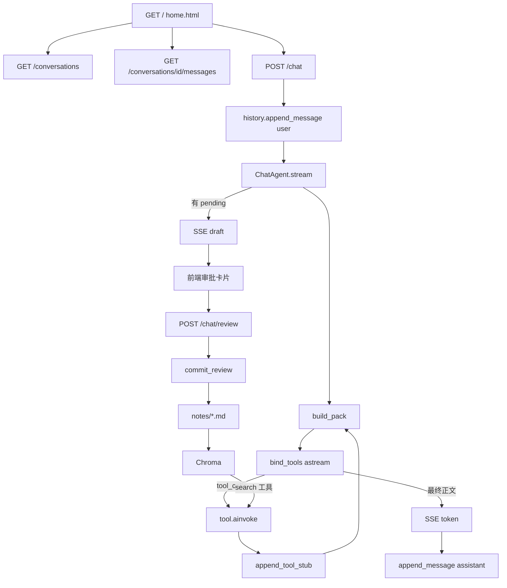

# NoteAgent 软件架构说明书

本文描述**正在运行的** NoteAgent：它解决什么问题、系统边界在哪、模块如何划分、一次请求数据如何流动、关键决策为什么成立、代码落在哪些文件。

专题附件只补充参数、公式和表列，不替代本文：

| 附件 | 内容 |
|------|------|
| [chat-tools.md](./chat-tools.md) | 四工具参数、返回值、人审动作 |
| [context-management.md](./context-management.md) | 上下文 pack、K=T−F、stub 截断 |
| [database.md](./database.md) | `conversations` / `messages` 列、索引、实例行 |
| [retrieval.md](./retrieval.md) | 切块、Chroma 点、审批后同步、查询路径 |

读者：实现与维护本仓库的开发者。范围：`src/noteagent/`、`notes/`、`scripts/index_notes.py`、PostgreSQL 会话库、Chroma 派生索引。

---

## 1. 项目简介

### 1.1 一句话

NoteAgent 是个人学习笔记助手：在浏览器里对话，把值得保留的内容整理成 Markdown 草稿，经用户在卡片上同意后写入本地 `notes/`；已索引的笔记可供语义问答。

### 1.2 产品形态

单用户、单进程 Web 应用。浏览器打开一张由 FastAPI 下发的 HTML 页面；后端用 DeepSeek 做带工具的 Agent；会话进 PostgreSQL；正式知识是磁盘上的 Markdown；向量检索是由这些文件派生的 Chroma 索引。

进程入口：仓库根目录 [`main.py`](../../main.py)（读配置、打日志、启动 uvicorn）。

### 1.3 核心能力

1. **对话。** 多会话侧栏、气泡历史、SSE 流式回复。
2. **记笔记。** 模型通过工具提交草稿；用户审批后系统改文件（新建、追加、覆盖、删除）。
3. **问旧知识。** 工具按语义检索已索引笔记片段，再组织回答。

### 1.4 运行时原则

这三条决定了后面所有模块怎么切：

1. **LLM 只出提案。** 工具不能 `open()` 笔记。`propose_note` 只把草稿放进内存。
2. **磁盘只走人审。** `create` / `append` / `replace` / `delete` 只发生在 `commit_review`。
3. **气泡不是全过程。** 前端只画 `user` 与最终 `assistant`。工具调用给模型和日志，不进侧栏。

### 1.5 文档目的

打开本文应能回答：项目做什么、分成哪些模块、一次发消息数据怎么走、笔记为何不能由工具写盘、上下文为何分四层、已批准笔记如何进向量库、每个模块的代码在哪。

---

## 2. 项目背景

### 2.1 要解决的问题

学习过程中，材料来自对话、粘贴的讲义或外文。人需要一份**可长期保存、可检索、自己说了算**的笔记，而不是聊天记录本身，也不是模型直接改磁盘后无法撤销的文件。

同时，带工具的助手会在一轮里多次 `read_file` / 检索。若把工具全文永久塞进下一句的模型上下文，窗口会被撑爆，且未审批内容会混进「已有知识」。若只保留聊天气泡，重启后又不知道做过哪些工具。

### 2.2 约束

| 约束 | 对架构的影响 |
|------|----------------|
| 个人本机、单用户 | 无账号体系、无网关集群；一个 FastAPI 进程即可 |
| 笔记必须人类可读、可搬家 | 事实源用 Markdown 目录，而不是只进数据库 |
| 写错不能自动永久生效 | 人审卡片；工具无写盘权限 |
| 模型上下文有限 | Persistent / Runtime / 摘要分层；按完整 Turn 压缩 |
| 检索可以重建 | Chroma 与人审解耦；失败不回滚 Markdown；可按文件删点重建 |

### 2.3 质量属性（现行系统如何满足）

| 属性 | 做法 |
|------|------|
| 知识可信 | 人审后才改 `notes/`；未审批草稿不进 Chroma |
| 可恢复 | 会话与气泡在 PostgreSQL；重启后从 watermark 后 Persistent + 摘要重建模型上下文 |
| 可维护 | `chat` 单向依赖 notes / retrieval / db；路由不调 LLM |
| 可观测 | `AgentTraceHandler` 写 `var/logs/`，完整 prompt 不进聊天表 |
| 可迁移 | 笔记是普通 `.md` 文件 |

---

## 3. 总体架构

### 3.1 逻辑结构

系统是「浏览器 ↔ HTTP ↔ Agent ↔ 四种存储」：

```text
浏览器  home.html
    │  侧栏会话、气泡、输入、草稿卡片、SSE
    ▼
HTTP  chat/router.py
    │  会话 CRUD；POST /chat；POST /chat/review
    ▼
ChatAgent  chat/agent.py
    │  装配上下文 → bind_tools 循环 → SSE token / draft
    ├── LLM          llm/factory.py          DeepSeek
    ├── 工具         chat/tools.py            只读 + 提案
    ├── 上下文       context_pack / compact   Persistent + Runtime
    ├── 会话写入口   chat/history.py          → PostgreSQL
    ├── 草稿槽       chat/drafts.py           内存 DraftStore
    ├── 笔记 IO      notes/repository.py      仅 commit_review 写入
    └── 检索         retrieval/               工具 search；脚本 index
```

四种存储职责不同：PostgreSQL 管会话；`DraftStore` 管未审批全文；`notes/` 管正式知识；Chroma 管由 Markdown 派生的向量。

### 3.2 依赖方向

`chat` 可以调用 `notes`、`retrieval`、`llm`、`observability`、`db`。`retrieval` 可调用 `observability`（索引步骤）。`notes`、`retrieval`、`db` **不得** import `chat`。

笔记 IO 和会话 ORM 因此不夹带 HTTP 或模型循环，避免环状依赖，也便于单独测 Repository 与表结构。

### 3.3 装配

进程启动时 [`bootstrap/app.py`](../../src/noteagent/bootstrap/app.py) 的 `build_container` 把 Settings、engine、`FileNoteRepository`、`RetrievalService`、`DraftStore`、工具列表、`ChatAgent`、`ConversationStore` 焊进 `AppContainer`，挂到 `app.state.container`。路由只从容器取依赖，自己不 `new` 模型、不直连 Chroma。缺 `DATABASE_URL` 则装配失败，避免半初始化进程。

### 3.4 代码组织（开发视图）

```text
src/noteagent/
  bootstrap/      Settings、AppContainer、FastAPI
  web/            home.html
  chat/           路由、Agent、工具、草稿、上下文、会话写入口
  db/             ORM 与 engine（无 HTTP、无 LLM）
  notes/          Markdown IO
  retrieval/      切块、embedding、Chroma
  llm/            聊天模型工厂
  observability/  进程日志、Agent 追踪、索引步骤
alembic/          会话表迁移
notes/            正式笔记数据
scripts/          按篇重建 Chroma 等
```

---

## 4. 关键流程（数据流）

本节用一条主路径把前后端和存储串起来。模块内部细节见第 5 章。



**进页。** `GET /` 下发页面；侧栏 `GET /conversations`；点会话 `GET /conversations/{id}/messages`，只渲染 user / assistant。

**发一句。** `POST /chat`：先把本句 user 写入 PostgreSQL（新 `turn_id`），SSE 推 `conversation`（侧栏拿到 id），再 `ChatAgent.stream`。每一跳：按 watermark 后 Persistent、`running_summary`、本轮 Runtime、可选 draft 一行装配；超预算则压缩；再 `astream`。有 `tool_calls` 则本地执行、立刻写 stub、全文进 Runtime 再跳。无工具则推 `token`，路由把最终 assistant 入库。若本轮 `propose_note` 成功，再推 `draft`。

**人审。** `POST /chat/review` → `commit_review` → 改 `notes/`。写盘成功后按该 `file_name` 删除旧向量，再对当前全文切块写入 Chroma（`delete` 只删向量）。索引失败只记日志，不回滚文件。手动 [`scripts/index_notes.py`](../../scripts/index_notes.py) 仍可整篇重建。

---

## 5. 模块设计

每一小节固定四段：**职责**、**结构与协作**、**为什么**、**代码落点**。

模块按部署上的切分来写：前端；后端（HTTP、Agent 及其上下文/工具/草稿、笔记与检索、LLM、装配观测）；数据库。

### 5.1 前端

**职责。** 单页聊天：侧栏管会话，主栏画气泡，底栏发消息，草稿以卡片出现。不实现独立前端工程，不渲染工具过程。

**结构与协作。** 页面由 `GET /` 下发 [`web/templates/home.html`](../../src/noteagent/web/templates/home.html)。进页或切会话：`loadConversations` → `GET /conversations`；点会话再 `GET /conversations/{id}/messages`。发一句：立刻画 user 气泡和空的 assistant 气泡，`fetch("/chat")` 读 SSE——`conversation` 记下 id 并刷新侧栏，`token` 用 marked 增量渲染，`draft` 画出审批卡片。审草稿：同意、拒绝，或在 create/append 时改目标文件；`POST /chat/review`。结果再画一条助手说明（已写入 / 已删除 / 已取消）。侧栏还可 `PATCH` 重命名、`DELETE` 删除会话。`isStreaming` 为真时不能连发。

**为什么。** 界面只服务「对话 + 对人审草稿说是或否」。工具 hop 是模型内部过程，画出来会把笔记卡片和自我对话混在一起。单文件模板与 FastAPI 同进程下发，个人工具不需要打包流水线。

**代码落点。** [`src/noteagent/web/templates/home.html`](../../src/noteagent/web/templates/home.html)；[`web/__init__.py`](../../src/noteagent/web/__init__.py) `read_home_html`。

---

### 5.2 后端

后端是同一 FastAPI 应用里的应用层：HTTP 只做会话与两次聊天动作；认知循环在 Agent；笔记与检索是 Agent 调用的能力，不是另一套服务。

#### 5.2.1 HTTP 路由

**职责。** 把浏览器操作变成会话读写和「生成 / 审批」。路由里不调用 LLM，不直接 `open()` 笔记。

**结构与协作。** [`chat/router.py`](../../src/noteagent/chat/router.py) 由 `create_app` `include_router`。依赖从 `request.app.state.container` 取 `history` 与 `chat_agent`。请求体在 [`chat/schemas.py`](../../src/noteagent/chat/schemas.py)。

`POST /chat` 在流式开始前跑 Depends `resolve_conversation`：未知 id 则 **SSE 之前** 404；无 id 则 `history.create`，标题来自首句截断。然后 `start_turn()`、`append_message(user)`，进入 `agent.stream`。SSE：`conversation` 的 data 为 `{id, title}`；`token` 为字符串增量；`draft` 为 pending JSON。内部事件 `assistant_final` 只给路由写库，不推前端。空 data 不 yield。

| 方法 | 路径 | 谁调用谁 |
|------|------|----------|
| GET | `/` | 下发 home.html |
| GET | `/conversations` | `history.list_conversations`，侧栏按 `updated_at` 倒序 |
| GET | `/conversations/{id}/messages` | `history.list_messages`（仅 user/assistant）；缺会话 404 |
| PATCH | `/conversations/{id}` | `history.rename`；空标题或过长 400；不改 `updated_at` |
| DELETE | `/conversations/{id}` | `history.delete`，消息 CASCADE；204 |
| POST | `/chat` | 落库 user → `chat_agent.stream` → 落库最终 assistant |
| POST | `/chat/review` | `chat_agent.review` → `commit_review` |

**为什么。** 未知会话若在 SSE 已经开始后再 404，浏览器会卡在半开的流上。路由不调模型，HTTP 层可测、模型循环集中在 Agent。重命名不碰 `updated_at`，避免改标题就把会话顶到侧栏最前。

**代码落点。** [`chat/router.py`](../../src/noteagent/chat/router.py)、[`chat/schemas.py`](../../src/noteagent/chat/schemas.py)。

#### 5.2.2 Agent

**职责。** 一次用户发送对应一次 Turn：装配上下文、跑工具循环、yield token 与可选 draft。`review` 转到草稿模块。Agent 不直接写 `notes/`。

**结构与协作。** [`chat/agent.py`](../../src/noteagent/chat/agent.py) `ChatAgent.stream(question, thread_id, turn_id)` 把 `current_thread_id` / `current_turn_id` 写入 contextvars（`propose_note` 用来绑定会话）。局部列表 `runtime` 只活在这一次 HTTP 请求里。每跳：`pack_now()` → 超预算则 compact → `model.bind_tools(tools).astream(pack.messages)`。有 `tool_calls` 则 `ainvoke`，结果进 Runtime `ToolMessage`，并立刻 `history.append_tool_stub`。无 `tool_calls` 则 yield `token` 与内部 `assistant_final`。若 `DraftStore` 仍有 pending，再 yield `draft`。轮数受 `ContextBudget.max_tool_hops`（`CHAT_MAX_TOOL_HOPS`）限制。

这不是 LangChain `AgentExecutor`，也没有跨 Turn checkpointer。`bind_tools` 只把 JSON Schema 交给模型 API；循环、执行、写 stub 都在 `stream` 里。

**为什么。** 自写循环才能保证：当前 Turn 的 `read_file` 全文只给本轮后续 hop；下一句从 PostgreSQL 的 stub + 摘要重建，不会把上一轮全文 ToolMessage 残留给下一句。进程重启后 UI 气泡仍在库里，模型上下文同样从库重建。

**代码落点。** [`ChatAgent`](../../src/noteagent/chat/agent.py)；[`context_budget.py`](../../src/noteagent/chat/context_budget.py)；追踪 [`observability/agent_trace.py`](../../src/noteagent/observability/agent_trace.py)。

#### 5.2.3 工具与系统提示

**职责。** 四个工具是模型接触笔记世界的出口（三个只读，一个只提案）。系统提示决定何时问、何时搜、何时提案。没有单独的分类器服务。

**结构与协作。** [`build_chat_tools`](../../src/noteagent/chat/tools.py) 闭包注入 `notes`、`retrieval`、`drafts`。`bind_tools` 把函数签名（`propose_note` 用 Pydantic `ProposeNoteInput`）变成请求体里的 `tools` 数组，与 `messages` 并列发给模型。

| 名称 | 做什么 | 副作用 |
|------|--------|--------|
| `list_files` | `notes.list_notes()` | 无 |
| `read_file` | `notes.read` | 无 |
| `search_relative_from_chromadb` | `retrieval.search(query, top_k=3)` | 无 |
| `propose_note` | 校验动作与文件是否存在后 `DraftStore.put` | 不写磁盘、不写 Chroma |

提案动作：`append` / `create` / `replace` / `delete`。意图门在 [`prompts/system.txt`](../../src/noteagent/chat/prompts/system.txt)：闲聊不提案；材料用意不明先问；记笔记必须先 `list_files`；覆盖必须先读全文。参数细则见 [chat-tools.md](./chat-tools.md)。

**为什么。** 模型一旦能直接写文件，人审卡片失去意义，错误草稿会立刻污染 `notes/`。四工具 schema 很小，每轮都带上，避免切错「聊天/Agent」模式后无法记笔记。意图放在提示词，与 `stream` 同一次请求完成。

**代码落点。** [`chat/tools.py`](../../src/noteagent/chat/tools.py)、[`ProposeNoteInput`](../../src/noteagent/chat/drafts.py)、[`chat/prompts/system.txt`](../../src/noteagent/chat/prompts/system.txt)。`prompts/iterations/` 是调参归档，不是本模块结构的一部分。

#### 5.2.4 草稿与人审

**职责。** 暂存待审草稿；用户表态后由确定性代码改磁盘。不调用 LLM。

**结构与协作。** [`DraftStore`](../../src/noteagent/chat/drafts.py) 是 `dict[thread_id, NoteDraft]`，每会话最多一份 pending，进程重启即空。`NoteDraft.as_dict()` 即 SSE `draft` 与卡片字段。

[`commit_review`](../../src/noteagent/chat/drafts.py)：`pop` 后，`reject` 丢弃；`approve` 用草稿上的动作和文件名；`override` 必须带 `write_action` 与 `file_name`。`_write_draft`：`create` 先写 `# 标题` 再追加；`append` 追加；`replace` 覆盖；`delete` 删文件。路径非法或冲突则把 draft 放回 store。写盘成功后同步 Chroma（见 5.2.7）。

**为什么。** 草稿与气泡分开，避免模型把未审批全文当成已落盘知识。放内存是因为待审寿命短；重启后应重新提案，而不是静默写盘。写盘函数不含模型，失败可对同一份 draft 重试。

**代码落点。** [`chat/drafts.py`](../../src/noteagent/chat/drafts.py)；HTTP 见 5.2.1 `POST /chat/review`。

#### 5.2.5 上下文装配与压缩

**职责。** 决定每一跳 LLM 看见什么；窗口满时按完整 Turn 压缩，不切断正在进行的工具链。

**结构与协作。** 四层不要合成一条随意截断的队列：

| 层 | 存什么 | 给模型 | 给前端 |
|----|--------|--------|--------|
| Persistent | watermark 之后的 user、最终 assistant、tool stub | 是 | 仅 user / 最终 assistant |
| `running_summary` | 会话一行累积摘要 | 有则带上 | 否 |
| Runtime | 当前 Turn 的 tool_call 与工具**全文** | 仅本轮后续 hop | 否 |
| DraftStore | 待审笔记全文 | 一行工作区 | SSE 卡片 |

[`build_pack`](../../src/noteagent/chat/context_pack.py) 拼：system、工具定义、summary、Persistent、当前 user、draft 一行、Runtime。当前 Turn 已写入的 stub **不**再装进 pack。包体积达到窗口触发比例时，[`context_compact.py`](../../src/noteagent/chat/context_compact.py) 只从**已完成** Turn 切一段做成摘要，拼到旧 `running_summary`，watermark 推到被切的最后一个已完成 `turn_id`。旧 `messages` 行不删。

公式见 [context-management.md](./context-management.md)。

**为什么。** 「把刚才的对话整理成笔记」需要 watermark 以来的原文，不能每句只取最近几条。工具全文若跨 Turn 常驻，下一句会把整篇 `read_file` 再吃一遍。stub 逐步入库，重启后仍知道做过 list/search，又不把笔记正文再存进 PostgreSQL。压缩只切完整 Turn，内部路径上当前工具结果仍完整。摘要只覆盖被切段落再拼接，避免改写早期任务。Draft 独立一行，不和气泡表混装。

**代码落点。** [`context_pack.py`](../../src/noteagent/chat/context_pack.py)、[`context_compact.py`](../../src/noteagent/chat/context_compact.py)、[`context_tokens.py`](../../src/noteagent/chat/context_tokens.py)、[`history.py`](../../src/noteagent/chat/history.py)（`list_persistent_after_watermark` / `apply_compact` / `append_tool_stub`）。

#### 5.2.6 笔记文件

**职责。** `notes/` 是正式知识的事实源。人审之后才出现或改变文件。

**结构与协作。** [`FileNoteRepository`](../../src/noteagent/notes/repository.py) 根目录来自 Settings（默认 `notes/`）。`list_notes` / `read` / `exists` 给工具；`create` / `write` / `delete` 只给 `commit_review`。`_resolve` 拒绝空名、绝对路径、`..`、子目录。聊天记忆不写 `notes/context.md`。

**为什么。** Markdown 可 git、可编辑器打开、可整目录拷走。禁止嵌套路径，避免把文件名当成逃逸通道。`create` 按文件名写一级标题，append 正文从 `##` 起，避免一篇两个 `#`。

**代码落点。** [`notes/repository.py`](../../src/noteagent/notes/repository.py)；数据目录 [`notes/`](../../notes/README.md)。

#### 5.2.7 检索

**职责。** 把已经在磁盘上的 Markdown 切块、向量化、写入 Chroma，按查询返回片段。不改笔记文件，不改聊天状态。

**结构与协作。** [`RetrievalService`](../../src/noteagent/retrieval/service.py) 组合 [`MarkdownChunker`](../../src/noteagent/retrieval/chunker.py)（chunk 500、overlap 50）、[`SentenceTransformerEmbedder`](../../src/noteagent/retrieval/embedder.py)、[`ChromaVectorStore`](../../src/noteagent/retrieval/vector_store.py)。聊天只通过 `search_relative_from_chromadb` 调 `search(..., top_k=3)`，命中为 [`SearchHit`](../../src/noteagent/retrieval/models.py)。`index_note` 先按 `file_name` 删旧点再 upsert。`commit_review` 在写盘成功后调用 `index_note` 或 `delete_note`。手动脚本 [`scripts/index_notes.py`](../../scripts/index_notes.py) 走同一条 `index_note`。点结构、同步时序与查询丢掉 metadata 的现行行为见 [retrieval.md](./retrieval.md)。

**为什么。** 向量是派生数据，坏了可删 collection 重建，不必与人审同一事务。Agent 只拿片段文本，不操作 Chroma 内部 id。切块按字符，与扁平 `notes/*.md` 一致。

**代码落点。** [`src/noteagent/retrieval/`](../../src/noteagent/retrieval/README.md)、[`scripts/index_notes.py`](../../scripts/index_notes.py)；细则 [retrieval.md](./retrieval.md)。

#### 5.2.8 LLM

**职责。** 按配置构造聊天模型，只供给 `ChatAgent`。

**结构与协作。** [`llm/factory.py`](../../src/noteagent/llm/factory.py) `create_chat_model`：`init_chat_model`，`model_provider=deepseek`，模型名与密钥来自 Settings。路由和 Repository 不持有模型。压缩摘要走同一模型的 `ChatAgent._default_summarize`，只摘要被切掉的 Turn。

**为什么。** 换模型改工厂与环境变量，不改路由。密钥不进 git。

**代码落点。** [`llm/factory.py`](../../src/noteagent/llm/factory.py)、[`bootstrap/settings.py`](../../src/noteagent/bootstrap/settings.py)。

#### 5.2.9 装配与观测

**职责。** 启动时焊依赖；运行时记 LLM/工具/索引步骤，不把完整 prompt 或切块正文当聊天消息存库。

**结构与协作。** [`bootstrap/settings.py`](../../src/noteagent/bootstrap/settings.py) 读环境。[`bootstrap/app.py`](../../src/noteagent/bootstrap/app.py) `build_container` / `create_app`；lifespan 结束 `engine.dispose`。[`observability/logging.py`](../../src/noteagent/observability/logging.py) 配日志目录。每次 `stream` 挂 `AgentTraceHandler`：token 预览、工具入参出参截断、耗时。索引步骤由 [`IndexTrace`](../../src/noteagent/observability/index_trace.py) 打 INFO，`RetrievalService` 只在切块/embed/入库边界调用。都写入 `var/logs/`。

**为什么。** 排障看日志。若把工具全文进 `messages` 再过滤，漏过滤会让下一句吃到不该吃的正文。容器集中构造，避免每个路由自己加载句向量模型。事件文案集中在 observability，检索包不拼 log 字符串。

**代码落点。** [`bootstrap/app.py`](../../src/noteagent/bootstrap/app.py)、[`observability/agent_trace.py`](../../src/noteagent/observability/agent_trace.py)、[`observability/index_trace.py`](../../src/noteagent/observability/index_trace.py)、[`var/README.md`](../../var/README.md)。

---

### 5.3 数据库

**职责。** PostgreSQL 只存会话与消息（含 tool stub 与会话级摘要）。不存笔记正文，不调 LLM，不写 HTTP。

**结构与协作。** 两张表：`conversations` 1 — N `messages`，删会话 CASCADE。业务写入口只有 [`ConversationStore`](../../src/noteagent/chat/history.py)。`append_message` 只接受 `user` / `assistant`。`append_tool_stub` 写 `role=tool` 的预览行，不刷新 `updated_at`。前端 `list_messages` 过滤 tool 行。模型装配走 watermark 之后的全部 role。列、索引、实例见 [database.md](./database.md)。

ORM：[`db/models.py`](../../src/noteagent/db/models.py)。连接：[`db/engine.py`](../../src/noteagent/db/engine.py)。迁移：[`alembic/versions/`](../../alembic/versions/)，head `3d1c2b8a9e4f`。

**为什么。** 聊天要可切换、可重启恢复，所以进库。笔记要可读可搬家，所以不进这两张表。压缩改摘要和 watermark、不删行，早期气泡仍能画出来。stub 不顶 `updated_at`，避免一次 `list_files` 被当成「有新聊天」。`db` 不 import `chat`，表与 Agent 循环解耦。

**代码落点。** [`db/models.py`](../../src/noteagent/db/models.py)、[`db/engine.py`](../../src/noteagent/db/engine.py)、[`chat/history.py`](../../src/noteagent/chat/history.py)。

---

## 6. 数据架构

四种数据放在四个地方，不要混成一种 history：

| 数据 | 位置 | 生命周期 |
|------|------|----------|
| 会话气泡、stub、running_summary | PostgreSQL | 删会话 CASCADE；压缩不删消息行 |
| 当前 Turn 工具全文 | 进程内 Runtime | 本轮 HTTP 结束即丢 |
| 待审草稿全文 | 内存 DraftStore | 审批结束或进程重启即丢 |
| 正式笔记 | `notes/*.md` | 人审后的事实源 |
| 检索向量 | Chroma | 由已批准 Markdown 派生；写盘成功后按文件重建，可删重建 |

信息流：用户句 → PG user 行 → Agent pack →（工具全文仅 Runtime，stub 进 PG）→ SSE → PG assistant 行；提案全文走 DraftStore → 人审 → `notes/` → 该文件 Chroma 点。

---

## 7. 运行与配置

本机启动 PostgreSQL，设置 `DATABASE_URL`（`postgresql+psycopg://...`），`uv run alembic upgrade head`，再 `uv run python main.py`。浏览器访问监听地址（默认见 Settings 的 HOST/PORT）。

模型：`DEEPSEEK_API_KEY`、`CHAT_MODEL`。笔记目录：`NOTES_DIR`。向量：`CHROMA_DIR`、`EMBEDDING_MODEL` 等，见 [retrieval.md](./retrieval.md)。上下文窗口与压缩比例见 `.env.example` 与 [context-management.md](./context-management.md)。

这是单机进程，不涉及多实例部署图。日志在 `var/logs/`。
