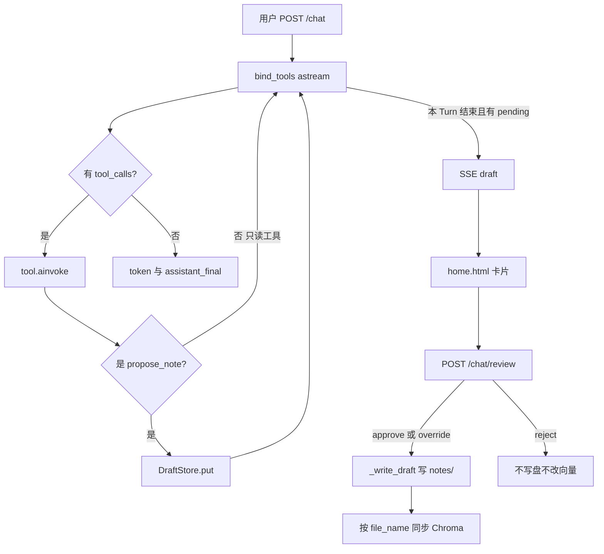

# 聊天工具（现行契约）

> 以代码为准。描述 Agent 四个 `@tool`、何时调用、参数与返回、以及人审后如何落盘。全局架构见 [architecture.md](./architecture.md)。  
> 工具 hop、stub 截断、Runtime vs Persistent 见 [context-management.md §7.1](./context-management.md#71-工具循环与-stub-截断)。  
> 切块、Chroma 点、审批后同步见 [retrieval.md](./retrieval.md)。

| 项 | 内容 |
|---|---|
| 装配 | [`build_chat_tools`](../../src/noteagent/chat/tools.py) → `ChatAgent` `bind_tools` |
| 落盘 | 仅 [`commit_review`](../../src/noteagent/chat/drafts.py)；工具函数不 `open()` 笔记 |
| 意图门 | [`prompts/system.txt`](../../src/noteagent/chat/prompts/system.txt) Task；无单独分类器服务 |

---

## 1. 范围与原则

四个工具：`list_files`、`read_file`、`search_relative_from_chromadb`、`propose_note`。

- LLM 只出提案或问答；禁止在回复里声称已经写入或删除文件。
- `list_files` / `read_file` / `search_relative_from_chromadb` **只读**。
- `propose_note` 只把一份 [`NoteDraft`](../../src/noteagent/chat/drafts.py) 放进按会话的内存 [`DraftStore`](../../src/noteagent/chat/drafts.py)，**不写磁盘、不写 Chroma**。
- 磁盘只在用户审批后的 `commit_review` → `_write_draft`：`FileNoteRepository.create` / `write` / `delete`。
- 审批写盘成功后同步该文件的 Chroma 点（先删旧再索引；`delete` 只删向量）。失败不回滚 Markdown。手动 [`scripts/index_notes.py`](../../scripts/index_notes.py) 仍可用。

路径规则在 [`FileNoteRepository._resolve`](../../src/noteagent/notes/repository.py)：拒绝空名、绝对路径、`..`、子目录。工具侧把异常收成 `{error: str}`。

---

## 2. 工作流

实现要点（[`agent.py`](../../src/noteagent/chat/agent.py) `stream`）：

- 每 hop：`pack_now()` → 可选压缩 → `bound.astream`。无 `tool_calls` 则吐 token 并结束。
- 有调用则 `tool_map[name].ainvoke(args)`，结果 `json.dumps` 进 Runtime `ToolMessage`，并立刻 `append_tool_stub`。
- 工具轮数 ≥ `ContextBudget.max_tool_hops`（环境 `CHAT_MAX_TOOL_HOPS`，默认 8）则打断。细节见 context-management §7.1。
- 循环结束后若 `drafts.get(thread_id)` 非空，yield SSE `event: draft`，data 为 `NoteDraft.as_dict()`。
- `propose_note` 依赖 `current_thread_id`（`stream` 入口写入）。无 thread 则工具返回 `{error: "no thread_id"}`，不放草稿。

前端不渲染 tool stub。气泡只有 user / 最终 assistant。

---

## 3. 何时调用

写在 `system.txt` Task，实现时不要另做隐藏分类器。

| 用户本句 | 工具 | 禁止 |
|----------|------|------|
| 闲聊、寒暄、与笔记无关的问答 | 不调 `propose_note` | 提案 |
| 问以前学过什么、笔记里怎么写的 | 先 `search_relative_from_chromadb`，必要时 `read_file` | 编造旧笔记；顺便提案 |
| 只贴长文/外文，没说要记、翻译、润色、摘要或抽取 | 一两句话问要做什么 | 因材料长而自动提案 |
| 已说明要记下来 / 翻译 / 润色 / 摘要 / 只保留某部分 | 必须先 `list_files`；可能撞车时 `read_file` 或 search；相近文件则 `propose_note(append)`，否则 `create` | 把「再记一笔」做成 `replace` |
| 明确更正、覆盖、改掉已有过时/错误表述 | 先 `list_files`，再 `read_file` 全文，然后 `propose_note(replace)`；content 为完整文件（含原有一级标题） | 不读就覆盖；只交改动的几行 |
| 明确删除某篇笔记文件 | 先 `list_files` 确认文件名，必要时 `read_file`，然后 `propose_note(delete)`；content 可空 | 未确认文件名就删 |

提案成功后助手回复一两句「已提交审批」，不粘贴完整草稿（卡片单独显示）。

---

## 4. 四工具契约

均由 `build_chat_tools(notes, retrieval, drafts)` 闭包捕获依赖。异常普遍变成 `{error: str}`，不抛给模型循环（循环里另有一层 try，见 agent）。

### 4.1 `list_files`

| | |
|--|--|
| 描述（schema） | 列出 `notes/` 下已有笔记文件名。提案前必须先调用。 |
| 参数 | 无 |
| 成功 | `{files: list[str]}` — `notes.list_notes()`（排序后的文件名） |
| 失败 | `{error}` |
| 副作用 | 无写盘 |

### 4.2 `read_file`

| | |
|--|--|
| 描述 | 读取已存在的笔记。`file_name` 如 `Agent.md`。不能创建或修改文件。 |
| 参数 | `file_name: str` |
| 成功 | `{file_content: str}` — `notes.read` |
| 失败 | 空名 `{error: "no target file given"}`；缺失 / 路径非法 `{error}` |
| 副作用 | 无写盘 |

### 4.3 `search_relative_from_chromadb`

| | |
|--|--|
| 描述 | 按问题语义检索笔记片段。询问历史知识点时优先使用。 |
| 参数 | `query: str` |
| 成功 | `{fragments: list[str], count: int}`。内部 `retrieval.search(query, top_k=3)`（**3 写死在工具里**），只收集非空 `hit.content`。 |
| 失败 | `{error}` |
| 副作用 | 不写 Chroma、不改笔记 |

未索引或空库时 fragments 可为空列表，不算工具实现错误。点上的 `file_name` / `distance` 与审批后如何写入见 [retrieval.md](./retrieval.md)。

### 4.4 `propose_note`

`args_schema` 为 [`ProposeNoteInput`](../../src/noteagent/chat/drafts.py)。`action` 合法值即 `WRITE_ACTIONS`：`append` / `create` / `replace` / `delete`。

| 字段 | 类型 | 默认 | 含义 |
|------|------|------|------|
| `action` | 上列四值 | 必填 | 见 §5 |
| `file_name` | str | 必填 | 如 `Backtracking.md`；缺 `.md` 时 `markdown_name` 补上 |
| `content` | str | `""` | Markdown。`delete` 可空；其它 action 空则 `{error: "content is required"}` |
| `reason` | str | `""` | 一句话分类理由 |
| `similar` | str | `""` | 逗号分隔相近已有文件名，拆成 `NoteDraft.similar: list[str]` |

校验顺序（失败则**不** `put`）：

1. 无 `current_thread_id` → `{error: "no thread_id"}`
2. `action` 不在 `WRITE_ACTIONS`
3. 无 `file_name`
4. 非 `delete` 且无 `content`
5. `append` / `replace` / `delete` 且文件不存在
6. `create` 且文件已存在 → 提示改用 `append`

成功：`drafts.put(thread_id, NoteDraft(...))`，`existing_files=notes.list_notes()`。返回 `{status: "pending_review", action, file_name}`（`file_name` 已规范化）。同一 `thread_id` 再提案会覆盖上一份 pending。

---

## 5. `action` 与落盘

审批通过后 `_write_draft`（仍不调 LLM）：

| action | 提案时文件 | content | 落盘 |
|--------|------------|---------|------|
| `create` | 必须不存在 | 必填；不要一级标题（`create` 会先写 `#` + 无扩展名的文件名） | `notes.create` 然后 `write(append=True)` |
| `append` | 必须存在 | 必填；不要一级标题 | `write(append=True)` |
| `replace` | 必须存在 | 必填；整份新正文，含原有一级标题 | `write(append=False)` |
| `delete` | 必须存在 | 可空 | `notes.delete`（`unlink`） |

`replace` 没有节级 patch：模型必须先 `read_file`，再交合并后的全文。

---

## 6. 人审

HTTP：`POST /chat/review`，body [`ReviewRequest`](../../src/noteagent/chat/schemas.py)：`thread_id`、`action`；override 时再加 `write_action`、`file_name`。路由转到 `ChatAgent.review` → `commit_review`。

`commit_review` 先 `store.pop`：

| `action` | 行为 |
|----------|------|
| `reject` | `{status: "rejected"}`，不写盘 |
| `approve` | 用草稿的 `action` 与 `file_name` |
| `override` | `write_action` 必须 ∈ `WRITE_ACTIONS` 且带 `file_name`；否则把 draft 放回，`{error: "override requires write_action and file_name"}` |
| 其它 | 放回 draft，`{error: "unknown action ..."}` |

写盘失败（`FileNotFoundError` / `FileExistsError` / `NotePathError` / `ValueError`）同样放回 draft，返回 `{error}`。

成功：`{status: "written", action: target_action, file_name}`（delete 也用 `written`，不是另起 status）。

前端 [`renderDraftCard`](../../src/noteagent/web/templates/home.html)：

- `append` / `create`：同意、改追加到所选、改为新建、拒绝。
- `replace`：同意覆盖、拒绝；无 override 按钮。
- `delete`：同意删除、拒绝；不渲染 content。
- `sendReview`：`status === "written"` 且 `action === "delete"` 显示「已删除」，否则「已写入」。

后端 override 虽允许 `write_action` 为 replace/delete，当前卡片不会发出这两种 override。

`DraftStore` 进程内 dict，**重启丢失**。

---

## 7. 本文件不覆盖

- 笔记 rename、节删除、节级 diff/patch、回收站
- 工具内 `write` / `delete` / 覆盖
- 独立 Reviewer、ChangeSet 表、多 pending 队列（每会话最多一份草稿）

---

## 8. 代码索引

| 文件 | 角色 |
|------|------|
| [`chat/tools.py`](../../src/noteagent/chat/tools.py) | 四个工具 |
| [`chat/drafts.py`](../../src/noteagent/chat/drafts.py) | schema、DraftStore、`commit_review` |
| [`chat/agent.py`](../../src/noteagent/chat/agent.py) | hop 循环、SSE draft、`review` |
| [`chat/router.py`](../../src/noteagent/chat/router.py) | `POST /chat`、`POST /chat/review` |
| [`chat/schemas.py`](../../src/noteagent/chat/schemas.py) | `ReviewRequest` |
| [`prompts/system.txt`](../../src/noteagent/chat/prompts/system.txt) | 意图门与质量约束 |
| [`web/templates/home.html`](../../src/noteagent/web/templates/home.html) | 审批卡片 |
| [`notes/repository.py`](../../src/noteagent/notes/repository.py) | 真正 IO |
| [retrieval.md](./retrieval.md) | 切块、Chroma、审批后同步（不在本文展开） |
| [`evals/prompt/`](../../evals/prompt/README.md) | 人工意图门（含 replace/delete） |
