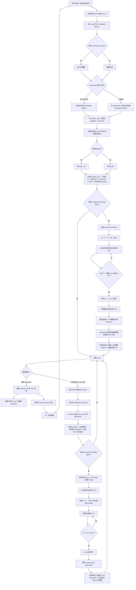

# NoteAgent 短期记忆与上下文管理

| 项 | 内容 |
|---|---|
| 状态 | **已按本文改代码** |
| 日期 | 2026-08-26 |
| 范围 | 单会话内：如何把历史、工具、草稿装配进 LLM；何时压缩 |
| 不在范围 | 多用户权限、对话向量检索、多 Agent、长期知识图谱、用户可选「纯聊天/Agent」模式 |
| 产品边界 | 笔记仍只经审批写入 `notes/`；问答检索已审批笔记。见 [draft-generation.md](./draft-generation.md) |
| 现行代码 | 展示历史在 PostgreSQL（user/assistant）；模型跨回合靠 watermark 后 Persistent + `running_summary`；退出 `summarize_on_exit` 为空实现，不写 `context.md`。已按本文落地 |

本文是聊天上下文的**唯一实现契约**。下文「决策记录」里的旧方案均已否决，不要再混用。

---

## 1. 要解决什么

NoteAgent 是带工具的笔记助手。同一会话里模型必须：

- 看见足够的对话，才能执行「把刚刚的对话整理成笔记」这类指向更早 user 的任务；
- 在一次 Agent Run 内多次调工具时，看见**当前** `read_file` / 检索的**全文**；
- 在窗口变满时丢掉可丢的旧 Persistent 历史，而不是切断正在进行的 Turn；
- 重启进程后仍能从库恢复「做过哪些工具」，而不是只剩聊天气泡。

前端继续只展示 **user** 与 **最终 assistant**。工具过程给模型与日志，不给侧栏气泡。

---

## 2. 概念

### 2.1 Turn

一次 **用户发送消息** 触发的完整 Agent Run，到 **最终 assistant 正文入库** 结束。

```text
Turn N
├── user                         → Persistent
├── assistant tool_call          → Runtime（全文）；Persistent 不存自我输出
├── tool result 全文             → Runtime
├── tool stub                    → Persistent（名 + 参数 + 输出前 N token + status；N 来自环境）
├── …可重复 tool_call / result / stub
└── final assistant              → Persistent；Turn 完成；丢弃本 Turn Runtime 全文
```

逻辑上需要 `turn_id`。压缩只切 **已完成** Turn 的边界。watermark **不得**指向尚未最终输出的当前 Turn。

### 2.2 四层存储（不要合成一条可随意截断的队列）

| 层 | 存什么 | 给模型 | 给前端 |
|---|---|---|---|
| Persistent History | `user`、最终 `assistant`、tool stub | watermark 之后的未压缩段 | 仅 user / 最终 assistant |
| running_summary | 该会话**一行**累积摘要（见 §4） | 有则每轮带上 | 不显示 |
| Runtime Context | 当前 Turn 的 tool_call + **完整** Tool Result；进程结束或 Turn 结束即丢 | 仅当前 Run 的后续 LLM | 无 |
| DraftStore | 待审笔记全文 | 一行工作区 | SSE 卡片，不是气泡 |

完整 Tool Result **不要求**永久保存。对长期有用的结论由 summary 抽取，或下次再调工具。

**Runtime 何时消失：** 当前 Turn 的全文工具链只在**这一次 HTTP `/chat` 请求的内存**里。最终 assistant 入库后立刻丢掉。进程退出、崩溃、重启后同样没有 Runtime（只能从库里的 stub + summary + 气泡重建）。侧栏换到别的会话：上一会话若已经跑完 Turn，Runtime 早已丢；不会在服务端按会话常驻一份全文工具缓存。

检查：继续 `AgentTraceHandler` → `var/logs/noteagent.log`。不把完整 prompt / 工具全文写入聊天表。

### 2.3 外部 Context 与内部 Context

同一套 80% 触发规则，差别是包里**有没有当前全文 Tool Result**。

**外部**（本 Turn 第一次调模型，尚无当前工具全文）：

```text
system + tool definitions
+ 当前 user
+ running_summary?
+ draft?（待审一行）
+ 未压缩 Persistent History
+ 当前 Runtime（若本 Run 已有内容；首次通常为空）
```

**内部**（已发生工具调用，含 `read_file`）：

```text
system + tool definitions
+ 当前 user
+ running_summary?
+ draft?
+ 未压缩 Persistent History（不含与全文重复的「当前这一跳」stub）
+ 当前 Turn trajectory
+ 当前完整 Tool Result
```

`read_file` 只走内部路径。不要在外部预留 40%「给还没发生的工具」。

---

## 3. 需求

### 3.1 功能

1. 用户发送后立刻把本句 user 写入 PostgreSQL，并分配本 Turn 的 `turn_id`。
2. 组装时默认读取 **watermark 之后的全部** Persistent 记录（从未压缩则读该会话全部已落库记录）。**禁止**「每次输入只取最近 K 条消息」。
3. 当前包 token ≥ `W × 80%` 时触发压缩。
4. 压缩后目标水位 `T = W × 60%`（可配置）。历史保留预算 `K = T − F`（见第 5 节）。
5. 压缩只处理已完成 Turn 的 Persistent History；从当前往历史累加完整 Turn，直到再加一个会超过 K；**不拆 Turn**。
6. 内部超限时优先保护：当前 Turn > 当前 Tool Chain > 当前完整 Tool Result；从更早 Persistent / 已完成旧 Turn 回收空间。
7. 每步工具结束后立刻写 stub 入库；Runtime 保留全文供本 Run 下一跳 LLM。
8. 最终 assistant 入库后丢弃本 Turn Runtime 全文。下一句或重启只从库 + summary 再装外部 Context。
9. 列表 API 过滤 tool stub；前端不渲染工具过程。
10. 停止用 `context.md` 充当聊天记忆。禁止跨 Turn 堆积全文 ToolMessage；本 Turn 全文只活在 `stream()` 局部 `runtime` 列表，不用 LangGraph checkpoint。

### 3.2 非功能

- 摘要模型的输出只覆盖被切掉的完整 Turn，**拼接到**旧 `running_summary`，不把「旧摘要 + 旧历史」重写成一篇而丢失早期任务目标。
- 摘要必须保住用户任务（本句或更早的「整理成笔记」）。
- W、触发/目标比例、stub 预览 **token 数**、参数截断、Output Reserve、Safety Buffer **全部从环境变量读取**（经 Settings）。压缩与 Agent 代码里禁止出现这些数字的字面量。
- Stub 预览按 **token** 截断（与 W 同一套 `estimate_tokens`），不是按字符。环境变量 `CONTEXT_STUB_PREVIEW_TOKENS`（`.env.example` 建议 `1000`）表示最多保留这么多 token。
- 环境变量一览（只出现在 `.env` / Settings，不出现在 compact 字面量）：`CHAT_CONTEXT_WINDOW`（token）、`CONTEXT_TRIGGER_RATIO`、`CONTEXT_TARGET_RATIO`、`CONTEXT_STUB_PREVIEW_TOKENS`、`CONTEXT_ARGS_PREVIEW_CHARS`、`CONTEXT_OUTPUT_RESERVE`、`CONTEXT_SAFETY_BUFFER`、`CHAT_MAX_TOOL_HOPS`。
- Stub 预览的「token」是 `estimate_tokens`（约 4 字符 = 1），**不是**模型 API 返回的 `usage` / `completion_tokens`。
- K 下限：若存在已完成 Turn，至少保留 1 个完整 Turn，即使略超 T。

### 3.3 明确不做

用户切换纯聊天/Agent；工具全文或 Agent 自我输出进库；对话进 Chroma；PostgresSaver 持久化当轮全文自我对话；语义任务识别、自动 segment、importance scoring、多级 memory。

---

## 4. 数据落地（逻辑，不强制拆表）

表列、索引、Store、实例行见 [database.md](./database.md)。本节只定要存什么。

会话级（绑在 **`conversations.id`**，一条会话一行，不是每条消息一栏）：

- `running_summary`（text）：该会话**唯一**摘要栏。每次压缩把「被切掉的完整 Turn」的新摘要 **追加** 到本栏（`旧摘要 + 空行 + 新段落`），不另开列、不按 Turn 拆行。新会话为 `NULL`；删会话则本栏一起删。
- watermark：已纳入摘要的最后 **已完成** `turn_id`（或等价记录 id）

记录级（可一张 `messages` 扩 role，或 messages + tool_events）：

- `turn_id`
- `role`: `user` | `assistant` | `tool`
- user / assistant：`content` 为展示正文
- tool stub：`tool_name`、`arguments`（截断上限来自环境）、`output_preview`（输出前 N **token**，N 来自环境）、`truncated`、`status`

展示查询：`role IN (user, assistant)`。模型装配：watermark 之后全部 role。

Draft 仍按会话存在 DraftStore（后续可持久化，但不并入气泡表）。

---

## 5. 压缩算法

### 5.1 符号

```text
W = 模型 Context Window
触发 = 当前 Context token ≥ W × 0.80
T = W × 0.60          # 压缩后目标水位
F = 压缩后必须保留的非「历史 Turn」内容（当次实测）
K = T − F             # 希望留下的已完成历史 Turn 的 token 预算
```

**K 不是**消息条数、不是剩余窗口、不是 80% 本身、不是固定常数。

F 包含：System、Tools、Summary、当前 User、Runtime Context（内部含全文 Tool Result）、draft 一行（若有）、Output Reserve、Safety Buffer。内部路径 F 更大、K 更小，是预期。

例：W=32K，T=19.2K，F=14K → **K=5.2K**。

### 5.2 保留哪些 Turn

从当前往历史，累加已完成 Turn 的 **Persistent** token：

```text
Turn10=1.5K, Turn9=1.8K, Turn8=1.2K → 4.5K
再加 Turn7=2.0K → 6.5K > K
→ 保留 Turn 8～10（约 4.5K），Turn 1～7 进入 summary
```

不为凑满 5.2K 而拆 Turn 7。

### 5.3 目标水位为何用 60% 而不是 50%

T 越小 K 越小。同样 F=14K 时 T=50% → K≈2K，往往只剩一两个短 Turn。触发 80% 与目标 60% 一次约腾 20% 窗口；压到 50% 更容易摘要漂移。T 贴近 75% 会与触发贴太近、来回压。默认 80/60，用日志再调；K 至少留 1 个已完成 Turn。

---

## 6. 流程图



---

## 7. 与现有模块的接口

| 模块 | 落地要点 |
|---|---|
| [`src/noteagent/db/models.py`](../../src/noteagent/db/models.py) | `turn_id`、tool stub 字段、`running_summary`、watermark；Alembic |
| [`src/noteagent/chat/history.py`](../../src/noteagent/chat/history.py) | 按 Turn 追加 user/assistant/stub；按 watermark 列出未压缩段；列表 API 过滤 |
| [`src/noteagent/chat/agent.py`](../../src/noteagent/chat/agent.py) | 装配外部/内部包；token 估算；压缩；每工具回调先写 stub；短命 Runtime；去掉跨 Turn 全文 saver |
| [`src/noteagent/chat/drafts.py`](../../src/noteagent/chat/drafts.py) | 待审仍独立；装配只注入一行 |
| [`src/noteagent/observability/agent_trace.py`](../../src/noteagent/observability/agent_trace.py) | 继续记工具与 LLM；压缩事件打日志（触发时 token、K、F、切掉哪些 turn_id） |
| 前端 [`home.html`](../../src/noteagent/web/templates/home.html) | 仍只渲染 user / assistant；draft 卡片不变 |

### 7.1 工具循环与 stub 截断（代码现状）

LangChain **不是** AgentExecutor：`@tool` 只生成 schema，`model.bind_tools` 把 schema 交给模型。循环在 [`agent.py`](../../src/noteagent/chat/agent.py) 自写：`while True` → `astream(pack.messages)` → 若有 `tool_calls` 则 `tool_map[name].ainvoke(args)`（本地 Python：`read_file` 等）→ dict 经 `json.dumps` 得到全文字符串 `out`。`CHAT_MAX_TOOL_HOPS` 限制工具轮数。

同一份 `out` 两条路：

1. **Runtime：** `runtime.append(ToolMessage(content=out, ...))`。下一 hop 的 [`build_pack`](../../src/noteagent/chat/context_pack.py) 把 `runtime` 接到消息末尾。当前 Turn 的 Persistent stub **不装进 pack**，避免 stub+全文双份。
2. **Postgres：** 立刻 `append_tool_stub`。入库的是预览，不是全文。

窗口、压缩、stub 统一用 [`estimate_tokens`](../../src/noteagent/chat/context_tokens.py)：`max(1, (len(text)+3)//4)`（空串为 0）。**不用** API 的 `usage` / `completion_tokens`。助手气泡是流式 `chunk.content` 拼字，同样不是账单 token。

截断：[`prefix_until_tokens(out, N)`](../../src/noteagent/chat/context_tokens.py)，N=`CONTEXT_STUB_PREVIEW_TOKENS`（建议 1000）。全文已 ≤ N 则整段入库 `truncated=false`；否则二分最短前缀使估算 token ≥ N，`truncated=true`。工具参数按**字符**切：`arguments[:CONTEXT_ARGS_PREVIEW_CHARS]`。

F 里 Runtime 按 **全文** 计 token，所以长 `read_file` 会把 K 压小。库里 stub 只影响**下一句** Persistent 体积。

---

## 8. 验收

1. 同一会话第二句：模型输入含库中未压缩 Persistent（含更早 user），不含上一 Turn 的全文 `read_file`。
2. 进程重启后：能装 summary + watermark 之后记录 + stub；UI 历史完整。
3. 一次 Turn 内两次工具：第二次 LLM 能看见第一次的**全文** Runtime Result。
4. Context ≥ 80%W：只摘要更早完整 Turn；当前 Tool Result 仍完整（内部路径）。
5. 压缩后 summary 为旧摘要拼接，且含任务目标；watermark 不落在未完成 Turn。
6. `GET .../messages` 无 tool stub；无新的 `context.md` 记忆写入。

---

## 9. 决策记录（问题 → 否决 → 敲定）

按讨论顺序。**只保留最后一列作为实现依据。**

| 问题 | 曾考虑 | 否决原因 | 敲定 |
|---|---|---|---|
| 跨 Turn 模型吃什么 | 只用 DB 的 user/最终 assistant；或继续 InMemorySaver 全文工具链 | 前者「整理刚刚的对话」会丢过程；后者重启丢失且全文污染下一句 | Persistent 未压缩段（含 stub）+ summary；全文工具只在当前 Runtime |
| 近 K 是否每次只取 K 条 | 每次 fetch 最近 K 条混合记录 | 没超窗就把任务原话裁掉 | 默认 watermark 以来**全量**；K 仅压缩时用，且是 **token 预算** 不是条数 |
| 工具结果是否入库 | 不入库 / 全文入库 / 只一行结论 | 不入库则重启无过程；全文入库等于再存一遍笔记 | **stub 实时入库**（名+参数+输出前 N token，N 来自环境）；全文仅 Runtime |
| stub 何时写 | 整轮结束批量写 | 崩溃则当轮过程全丢 | **每步工具完成后立刻写** |
| 内部超限是否与历史同一套截断 | 把当前 10K Tool Result 和旧气泡一起按 K 条切 | 会切断当前推理 | 保护当前 Turn/Chain/Result；只压已完成旧 Turn |
| 切割单位 | 按 token 一刀切；按消息条数 | 会拆开一次 Run | **完整 Turn 边界**，宁可略超 K |
| 摘要怎么更新 | 旧摘要+旧历史再生成一篇 | 早期约定被改写 | **只摘要被切 Turn，拼到旧 summary** |
| 外部 60% / 内部 80% | 外部先压到 60% 给 read_file 留 40% | 工具未发生；闲聊也会过早压缩；read_file 本就是内部路径 | **触发统一 80%**；目标压缩到 **60%**（K=T−F） |
| 目标是否改 50% | 更空更安全 | F 大时 K 过小 | **默认 60%**，配置化，日志再调 |
| Draft 是否进 messages | 当一条聊天 | 和气泡、近端历史混在一起 | **独立槽** + 卡片 |
| 要不要用户选纯聊天模式 | 省工具 schema | 四工具 schema 很小；切错则无法笔记 | **不切换**；每轮带工具定义 |
| 工具过程给前端/另表调试 | 全量进 messages 再过滤 | 装配易误带全文 | 前端过滤；排障用**日志** |
| LangGraph checkpoint | 跨会话 InMemorySaver；PostgresSaver 存自我对话 | 跨 Turn 泄漏全文；第二套聊天库 | **自写 bind_tools 循环 + 当前 Turn 内存 runtime；无 saver** |
| 对话进 RAG | 从旧聊天再检索 | 与「已审批笔记才进 RAG」冲突 | **不把聊天送 Chroma** |
| context.md | 退出追加学习状况 | 笔记目录冒充记忆 | **停止作为聊天记忆** |

与 [draft-generation.md](./draft-generation.md) §4 的关系：该文「完整聊天历史不发给模型」是更早的分层口号。本文将其落实为：**发给模型的是 watermark 之后的 Persistent（含 stub）+ summary + 当前 Runtime，不是库内从第一句到现在的无限原文，也不是仅 user/assistant 两条。** 已审批笔记仍只经 Retrieval 工具进入窗口。实现聊天上下文时以**本文**为准；代码已按本文落地（无跨 Turn `InMemorySaver`）。
