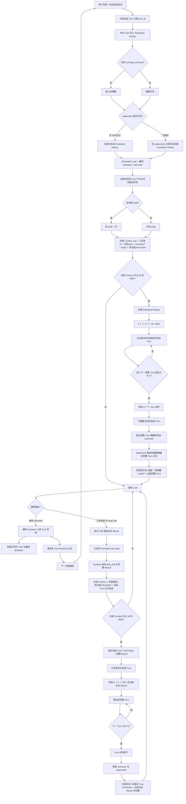

# 短期记忆与上下文装配

全局职责与四层划分见 [architecture.md §5.2.5](./architecture.md#525-上下文装配与压缩)。本文是现行实现的公式、流程图、stub 截断与文件对应。

| 项 | 内容 |
|---|---|
| 范围 | 单会话内：如何把历史、工具、草稿装进 LLM；何时压缩 |
| 代码 | watermark 之后的 Persistent + `running_summary` + 当前 Turn Runtime；不写 `context.md` |

---

## 1. 要解决什么

同一会话里模型必须：

- 看见足够的对话，才能执行「把刚刚的对话整理成笔记」；
- 在一次 Turn 内多次调工具时，看见**当前** `read_file` / 检索的**全文**；
- 窗口满时丢掉可丢的旧 Persistent，而不是切断正在进行的 Turn；
- 重启后仍能从库恢复「做过哪些工具」，而不是只剩聊天气泡。

前端只展示 **user** 与 **最终 assistant**。

---

## 2. 概念

### 2.1 Turn

一次用户发送触发的完整 Agent Run，到最终 assistant 正文入库结束。

```text
Turn N
├── user                         → Persistent
├── assistant tool_call          → Runtime（全文）；Persistent 不存自我输出
├── tool result 全文             → Runtime
├── tool stub                    → Persistent（名 + 参数 + 输出前 N token + status）
├── …可重复
└── final assistant              → Persistent；丢弃本 Turn Runtime 全文
```

压缩只切 **已完成** Turn。watermark 不得指向尚未最终输出的当前 Turn。

### 2.2 四层存储

| 层 | 存什么 | 给模型 | 给前端 |
|---|---|---|---|
| Persistent History | `user`、最终 `assistant`、tool stub | watermark 之后的未压缩段 | 仅 user / 最终 assistant |
| running_summary | 该会话一行累积摘要 | 有则每轮带上 | 不显示 |
| Runtime Context | 当前 Turn 的 tool_call + 完整 Tool Result | 仅当前 Run 的后续 LLM | 无 |
| DraftStore | 待审笔记全文 | 一行工作区 | SSE 卡片 |

完整 Tool Result 不进库。Runtime 只活在这一次 `POST /chat` 的内存里；Turn 结束或进程退出即丢。排障看 `AgentTraceHandler` → `var/logs/noteagent.log`。

为什么这样分：跨 Turn 若继续堆全文 ToolMessage，下一句会把整篇 `read_file` 再吃一遍；若 Persistent 只有气泡、没有 stub，重启后模型不知道做过 list/search。Draft 不进 `messages`，避免和气泡、近端历史混在一起。

### 2.3 外部 Context 与内部 Context

同一套触发规则，差别是包里有没有当前全文 Tool Result。

**外部**（本 Turn 第一次调模型）：

```text
system + tool definitions
+ 当前 user
+ running_summary?
+ draft?（待审一行）
+ 未压缩 Persistent History
+ 当前 Runtime（首次通常为空）
```

**内部**（已发生工具调用）：

```text
同上底座 + 当前 Turn Runtime 全文轨迹
```

当前 Turn 的 Persistent stub 不装进 pack，避免与 Runtime 全文双份。

---

## 3. 装配规则

1. 用户发送后立刻把本句 user 写入 PostgreSQL，并分配本 Turn 的 `turn_id`。
2. 默认读取 **watermark 之后的全部** Persistent。不是「每次只取最近 K 条消息」；K 只在压缩时作为 **token 预算**。
3. 当前包 token ≥ `W × 触发比例`（默认 80%）时压缩。
4. 压缩后水位 `T = W × 目标比例`（默认 60%）。历史保留预算 `K = T − F`。
5. 只切已完成 Turn 的 Persistent；从当前往历史累加完整 Turn，直到再加一个会超过 K；不拆 Turn。若存在已完成 Turn，至少保留 1 个，即使略超 T。
6. 内部超限时保护：当前 Turn > 当前 Tool Chain > 当前完整 Tool Result；从更早 Persistent 回收空间。
7. 每步工具结束后立刻写 stub；Runtime 保留全文供本 Run 下一跳。
8. 最终 assistant 入库后丢弃 Runtime。下一句或重启只从库 + summary 再装。
9. 列表 API 过滤 tool stub。
10. 不用 `context.md` 当聊天记忆；不用 LangGraph checkpoint 堆积跨 Turn 全文。

摘要只覆盖被切掉的完整 Turn，**拼接到**旧 `running_summary`（`旧摘要 + 空行 + 新段落`），保住用户任务目标，不把「旧摘要 + 旧历史」整篇重写。

W、触发/目标比例、stub 预览 token、参数截断、Output Reserve、Safety Buffer、`CHAT_MAX_TOOL_HOPS` 全部经 Settings 读环境变量，压缩与 Agent 代码里不写死这些数字。Stub 的「token」是 `estimate_tokens`（约 4 字符 = 1），不是 API `usage`。

环境变量：`CHAT_CONTEXT_WINDOW`、`CONTEXT_TRIGGER_RATIO`、`CONTEXT_TARGET_RATIO`、`CONTEXT_STUB_PREVIEW_TOKENS`、`CONTEXT_ARGS_PREVIEW_CHARS`、`CONTEXT_OUTPUT_RESERVE`、`CONTEXT_SAFETY_BUFFER`、`CHAT_MAX_TOOL_HOPS`。

本模块不管：对话进 Chroma、工具全文进库、按会话常驻一份全文工具缓存。

---

## 4. 数据落地

表列见 [database.md](./database.md)。会话级绑在 `conversations.id`：

- `running_summary`：该会话唯一摘要栏；压缩时追加。
- `summary_watermark_turn_id`：摘要已覆盖的最后已完成 `turn_id`；新会话 `NULL`。

记录级在 `messages`：`turn_id`；`role` 为 `user` | `assistant` | `tool`；tool 行含 `tool_name`、`tool_arguments`、`output_preview`、`truncated`、`status`。

展示查询：`role IN (user, assistant)`。模型 Persistent：watermark 之后全部 role。压缩不删旧行。

---

## 5. 压缩算法

### 5.1 符号

```text
W = 模型 Context Window
触发 = 当前 Context token ≥ W × 0.80
T = W × 0.60
F = 压缩后必须保留的非「历史 Turn」内容（当次实测）
K = T − F
```

K 不是消息条数、不是剩余窗口、不是 80% 本身。

F 包含：System、Tools、Summary、当前 User、Runtime（内部含全文 Tool Result）、draft 一行（若有）、Output Reserve、Safety Buffer。内部路径 F 更大、K 更小。

例：W=32K，T=19.2K，F=14K → K=5.2K。

### 5.2 保留哪些 Turn

从当前往历史，累加已完成 Turn 的 Persistent token：

```text
Turn10=1.5K, Turn9=1.8K, Turn8=1.2K → 4.5K
再加 Turn7=2.0K → 6.5K > K
→ 保留 Turn 8～10（约 4.5K），Turn 1～7 进入 summary
```

不为凑满 K 而拆 Turn 7。

### 5.3 为何默认 80% 触发、60% 水位

触发与水位同一套，闲聊与带工具的 Turn 都在包真正变满时才压，而不是外部路径先压到 60%「给 read_file 留空」（工具还没发生）。T=50% 时同样 F=14K 会把 K 压到约 2K，往往只剩一两个短 Turn，摘要更容易漂。T 贴近 75% 会与触发贴太近、来回压。默认 80/60，用日志再调。

---

## 6. 流程图



---

## 7. 代码落点

| 文件 | 做什么 |
|---|---|
| [`db/models.py`](../../src/noteagent/db/models.py) | `turn_id`、stub 字段、`running_summary`、watermark |
| [`chat/history.py`](../../src/noteagent/chat/history.py) | 按 Turn 追加；按 watermark 列出；列表 API 过滤 tool |
| [`chat/agent.py`](../../src/noteagent/chat/agent.py) | pack、压缩、每步写 stub、短命 Runtime |
| [`chat/context_pack.py`](../../src/noteagent/chat/context_pack.py) | `build_pack` |
| [`chat/context_compact.py`](../../src/noteagent/chat/context_compact.py) | `group_turns`、`select_turns_to_drop`、`should_compact` |
| [`chat/context_tokens.py`](../../src/noteagent/chat/context_tokens.py) | `estimate_tokens`、`prefix_until_tokens` |
| [`chat/drafts.py`](../../src/noteagent/chat/drafts.py) | 待审独立；装配只注入一行 |
| [`observability/agent_trace.py`](../../src/noteagent/observability/agent_trace.py) | LLM/工具日志；压缩打 K、F、切掉的 turn_id |
| [`home.html`](../../src/noteagent/web/templates/home.html) | 只渲染 user / assistant |

### 7.1 工具循环与 stub 截断

`@tool` 生成 schema，`model.bind_tools` 交给模型。循环在 `ChatAgent.stream`：`while True` → `astream(pack.messages)` → 有 `tool_calls` 则 `ainvoke` → `json.dumps` 得到全文 `out`。`CHAT_MAX_TOOL_HOPS` 限制轮数。

同一份 `out` 两条路：

1. **Runtime：** `ToolMessage(content=out)` 进局部 list，下一 hop 由 `build_pack` 接到末尾。
2. **Postgres：** 立刻 `append_tool_stub`。入库的是预览。

窗口、压缩、stub 统一用 `estimate_tokens`：`max(1, (len(text)+3)//4)`（空串为 0）。助手气泡是流式 `chunk.content` 拼字，同样不是账单 token。

截断：`prefix_until_tokens(out, N)`，N=`CONTEXT_STUB_PREVIEW_TOKENS`（`.env.example` 建议 1000）。全文已 ≤ N 则整段入库 `truncated=false`；否则取估算 token ≥ N 的最短前缀，`truncated=true`。工具参数按字符切：`arguments[:CONTEXT_ARGS_PREVIEW_CHARS]`。

F 里 Runtime 按**全文**计 token，长 `read_file` 会把 K 压小。库里 stub 只影响下一句 Persistent 体积。每步立刻写 stub，是为了这一跳之后崩溃仍留下「做过什么」。
