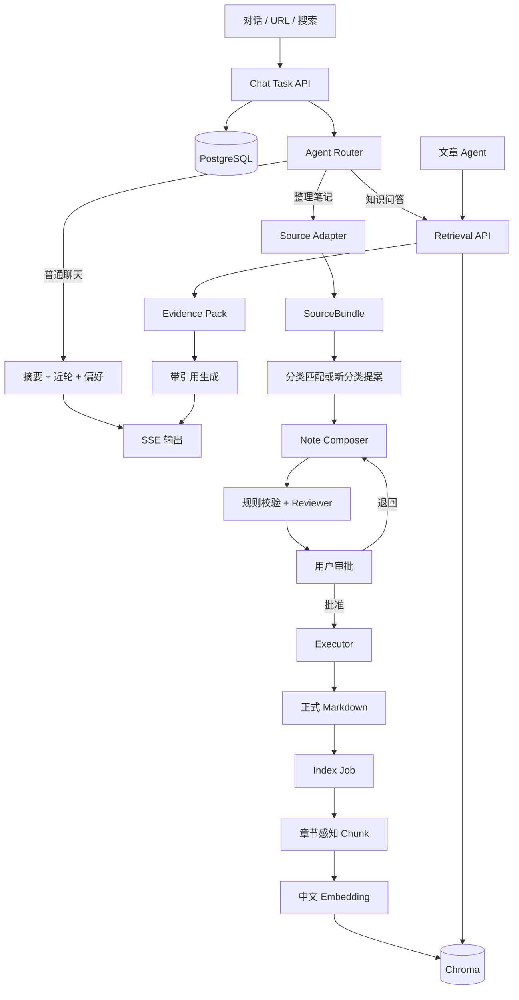

# 笔记草稿生成与入库

> 原名 `knowledge-workflow-v1.md`（2026-08-17）。本文描述**笔记如何从对话变成 Markdown** 的目标工作流（提案、人审、写入、索引），不是整站「知识平台」说明书。  
> 屏幕/OCR 起源见 [DESIGN.md](./DESIGN.md)。短期记忆见 [context-management.md](./context-management.md)。

| 项 | 内容 |
|---|---|
| 状态 | **目标架构**。Job 状态机、URL/搜索入库、审批后自动索引、带引用 Retrieval **尚未实现** |
| 代码已有 | 对话提案 → 前端审批 → 写 `notes/`；手动 `scripts/index_notes.py`；工具内粗检索 |

---

## 代码现状（更改文档前的证据）

下列句子过去写得像「系统已经这样」。与仓库对照后，只把**被代码证伪的现状**改成「目标 / 现状」分开写。目标流程正文（§2 起）保留。

| 文档旧表述 | 代码证据 | 处理 |
|---|---|---|
| PostgreSQL 含 IngestionJob、PostgresSaver | [`db/models.py`](../../src/noteagent/db/models.py) 仅 `conversations` / `messages`；[`agent.py`](../../src/noteagent/chat/agent.py) `InMemorySaver()` | §3 表改为「目标」；现状只会话消息 |
| 不把聊天摘要写入 `notes/context.md` | [`ChatAgent.summarize_on_exit`](../../src/noteagent/chat/agent.py) 向 `context.md` 追加；[`POST /chat/user_exit`](../../src/noteagent/chat/router.py) | 目标仍是停用；**现状会写** |
| 发给模型的短期记忆已是 watermark 方案 | 同上 `InMemorySaver`；[`chat/README.md`](../../src/noteagent/chat/README.md) 写明重启不带旧轮次 | §4 指向目标文档；现状单独一行 |
| 章节感知 Chunk、BGE、引用字段 | [`chunker.py`](../../src/noteagent/retrieval/chunker.py) 按字符切；[`settings.py`](../../src/noteagent/bootstrap/settings.py) 默认 `all-MiniLM-L6-v2`；[`SearchHit`](../../src/noteagent/retrieval/models.py) 仅 `content/distance/metadata` | §6 标明目标；现状为粗 RAG |
| 人审后才写盘 | [`propose_note`](../../src/noteagent/chat/tools.py) 不写盘；[`commit_review`](../../src/noteagent/chat/drafts.py) 才 `create`/`write` | **与代码一致，不改** |

可视化（目标流程，非运行时截图）：

- [noteagent-architecture.canvas.tsx](./noteagent-architecture.canvas.tsx)
- [noteagent-system-workflow.canvas.tsx](./noteagent-system-workflow.canvas.tsx)

---

## 1. 系统定位（目标）

NoteAgent 做两件事：

1. 把对话、明确 URL、Agent 搜索结果整理成高质量中文笔记，经人工审批后写入本地 Markdown。
2. 将已审批笔记自动索引，通过 Retrieval API 提供带引用的检索，供本系统问答和下游文章 Agent 使用。

**当前代码只稳定做到第 1 条的对话路径**（无独立 Router 分「普通聊天 | 笔记 | 问答」，无 URL/搜索 Source Adapter）。第 2 条是手动索引 + `search_relative_from_chromadb`。

原则：先保证知识可信，再保证检索，最后才优化聊天 UI。  
LLM 只产出结构化提案；写目录、写文件、改索引由确定性代码执行。

---

## 2. 端到端工作流（目标）

以下状态机、URL/搜索、Index Job **尚未落地**。对照现状：`POST /chat` → 工具 `propose_note` → SSE `draft` → `POST /chat/review` → `FileNoteRepository`。

```text
用户输入（中文对话 / URL / 搜索主题）
→ 消息先写入 PostgreSQL
→ Agent Router：普通聊天 | 笔记任务 | 知识问答
→ 笔记任务：Source Adapter 形成 SourceBundle
    Direct：规范化所选消息
    URL：Fetch 指定页（不另选来源）
    搜索：规划查询 → 筛选来源 → Fetch 入选页
→ 分类匹配或提出新分类
→ Note Composer：source-only 生成中文结构化草稿
→ 程序校验 + 独立 Reviewer
→ 用户审批 KnowledgeChangeSet（内容 / 分类 / 来源 / Diff）
    退回 → 回到 Composer
    批准 → Executor 原子写入 Markdown + 版本
→ Index Job：H2/H3 章节感知 Chunk（过长按段落拆、过短合并）
→ BGE-small-zh-v1.5 Embedding
→ Chroma 增量 upsert
→ Retrieval API 可检索
```

状态机（每个 IngestionJob）：

```text
SUBMITTED → FETCHED → CLASSIFIED → DRAFTED
→ PENDING_REVIEW → APPROVED → COMMITTED
→ INDEX_PENDING → INDEXED
```

失败单独记录（如 `FETCH_FAILED`、`INDEX_FAILED`），从对应阶段重试。  
Markdown 已提交但索引失败：只重试索引，不重新审批，不回滚笔记。



---

## 3. 存储边界

**目标**

| 存储 | 职责 |
|------|------|
| PostgreSQL | 会话、消息、IngestionJob、审批、分类目录、偏好、审计；LangGraph 可恢复 checkpoint |
| Markdown | 正式知识事实源，人类可读、可迁移 |
| Chroma | 由已审批 Markdown 派生的向量索引，可删除重建 |
| 网页正文 | 仅工作流期间临时使用，写入成功后丢弃 |

**现状（证据：`db/models.py`、`agent.py`）**

| 存储 | 实际 |
|------|------|
| PostgreSQL | 仅 `conversations`、`messages`（`role` 为 user/assistant） |
| LangGraph | `InMemorySaver`，按 `thread_id` 进程内保留 |
| Markdown | `notes/`；审批写入；**退出时仍会追加 `context.md`** |
| Chroma | 手动 `index_note`；collection 名来自配置 |

目标：**不把聊天摘要写入 `notes/context.md`**，不把未审批草稿送进 RAG。现状仍写 `context.md`，停用步骤见 [context-management.md](./context-management.md) 与实现顺序第 2 条。

稳定身份（目标）：`ingestion_id`、`note_id`、`note_version`、`category_id`、`source_content_hash`、`chunk_id`、`chunk_hash`。  
目录路径可变，不能当唯一 ID。ChangeSet 等半结构化字段用 JSONB。

---

## 4. 聊天与记忆

形态：普通对话 Agent，主能力是笔记整理。会话可切换、可恢复。

**现状：** 用户可见历史在 PostgreSQL；模型跨回合靠 `InMemorySaver`，重启后 UI 有气泡、模型不自动带旧轮次（[`chat/README.md`](../../src/noteagent/chat/README.md)）。

**目标：** 短期记忆装配与压缩见 [context-management.md](./context-management.md)（已敲定，代码未迁）。不要在本文展开 watermark / K 公式。

| 层 | 发给模型（目标） | 进 RAG |
|----|----------|--------|
| PostgreSQL 展示气泡 | 不把从第一句起的无限原文当默认包 | 否 |
| watermark 后 Persistent + running_summary + 当前 Runtime + draft 工作区 | 是 | 否 |
| 用户偏好（轻量，尚未建表） | 短 | 否 |
| 已审批笔记 | 仅经检索工具 | 是（索引仍须手动） |

LangGraph checkpoint 不是聊天库。偏好若落地：用户明确强调的全局规则才写入，不影响笔记正文当事实。

---

## 5. 笔记与质量（目标）

- 一篇来源对应一篇正式 Markdown（搜索任务可为一篇多来源综合笔记）。
- 统一 frontmatter + 按类型选正文模板。
- source-only：只依据选定来源；推论必须标明；冲突并列。
- 英文网页由 Composer 直接写成中文笔记，MVP 不加翻译模型。专有名词可保留中英对照。
- 不长期保存网页全文；保留 URL、标题、作者、`fetched_at`、`source_content_hash`。
- 三层质量门：程序校验 → 独立 Reviewer → 用户审批。
- LLM 不直接 `mkdir` / 写文件。新分类必须进 ChangeSet 由用户批准，Executor 创建目录并更新 Taxonomy。

**现状质量门：** 仅前端审批卡片；无独立 Reviewer、无 ChangeSet 表。写盘仍禁止出现在工具里（与目标一致）。

---

## 6. 检索

**目标**（未实现）：阈值、每篇最多 2 chunk、邻居展开、引用字段、`insufficient_evidence`、BGE-small-zh-v1.5、章节感知切块。

**现状（证据：`MarkdownChunker`、`RetrievalService.search`、`Settings.embedding_model`）：**

- 按字符与中文标点切块（默认 500/50），不是 H2/H3 路径。
- `search(..., top_k=3)`，无相似度阈值、无引用结构。
- 默认 embedding 为 `all-MiniLM-L6-v2`（可用环境变量覆盖）。

---

## 7. 实现约束（给 AI）

职责：LLM 只返回结构化提案；Service/Repository 执行文件、版本和索引。API 不直接操作向量库内部结构。  
幂等（目标）：副作用带 `ingestion_id`、`note_id`、`note_version`、`content_hash`。  
安全：网页是数据不是指令；Collector 无写文件权限。  
编排（目标）：LangGraph interrupt/resume/retry；`Job.status` 以 PostgreSQL 业务表为准。

建议实现顺序：

1. PostgreSQL + SQLAlchemy/Alembic 表与迁移（会话表已做）
2. 会话与消息持久化（已做）；去掉退出时写 `context.md`（未做）
3. SourceBundle / NoteDraft / KnowledgeChangeSet 与 Job 状态机
4. 短期记忆按 [context-management.md](./context-management.md) 替换跨回合 `InMemorySaver`
5. 审批 API 与确定性 Markdown Executor（审批写盘已有最小版）
6. 自动 Chunk、中文 Embedding、增量索引
7. 带阈值、去重、邻居展开和引用的 Retrieval API
8. 10–20 条人工查询评估集

MVP 不做：多用户权限、微服务、专用翻译模型、混合检索、rerank、自动知识合并、复杂长期记忆。
