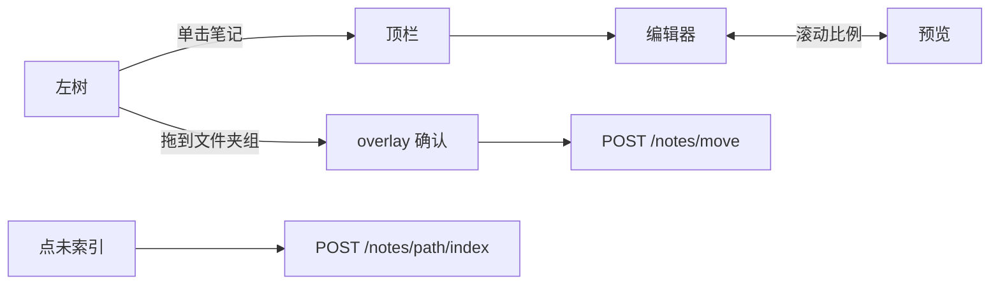

# 前端（现行界面）

> 以 [`home.html`](../../src/noteagent/web/templates/home.html) 为准。全局职责见 [architecture.md §5.1](./architecture.md#51-前端)。  
> 聊天工具与人审卡片字段见 [chat-tools.md](./chat-tools.md)。  
> 磁盘与向量同步见 [retrieval.md](./retrieval.md)。

| 项 | 内容 |
|---|---|
| 形态 | 单页，无独立前端工程、无 Vue/React 打包 |
| 下发 | `GET /` 与 `GET /documents` 都返回同一 `home.html`；`read_home_html()` 每次读盘 |
| 视图 | 顶栏切 Chat / Documents；用 `pathname` + `history.pushState` |
| 分区 | 聊天脚本不复用 Documents 弹窗 DOM；笔记路由不经过 Agent |

---

## 1. 范围与原则

一张 HTML 里两套主界面，CSS/JS 写在同一文件，但**业务不要串**：

1. **Chat 不管磁盘。** 侧栏是 PostgreSQL 会话。Agent 改笔记只通过审批卡片 → `POST /chat/review`。点 ① 打开的出处侧栏是人类写盘，走与 Documents 相同的 `PUT /notes/{path}`（无删除、无预览）。
2. **Documents 不调模型。** 树、编辑、入库只打 `/notes*`。保存/新建/移动/删除都是人类操作，与聊天审批并列，都算「人写盘」。
3. **工具过程不画。** 气泡只有 `user` 与最终 `assistant`。Documents 树也不显示 Agent hop。
4. **不建笔记表。** 最近修改用文件 `mtime`；已/未索引看 Chroma 有没有该相对路径的点。
5. **一层目录。** 树上文件夹与根目录 `.md` 同级；文件夹内笔记再缩进。根文件仍是 `notes/*.md`，不造磁盘上的「未分类/」。

Python 只负责读模板。业务规则在 `home.html` 的 fetch 与后端路由，不在 `web/` 里再包一层 API client。

---

## 2. 整页骨架

```text
┌──────────────────────────────────────────────┐
│ NoteAgent     Chat | Documents               │  .app-nav
├────────────┬─────────────────────────────────┤
│            │                                 │
│  左栏      │  主区（#viewChat 或 #viewDocs）  │  .app-shell
│  .sidebar  │                                 │
│            │                                 │
└────────────┴─────────────────────────────────┘
```

两个 `.app-shell` 同时在 DOM 里，用 `.active` 显隐。默认 Chat（`GET /`）。`GET /documents` 或点顶栏后 `showView("documents")`。

| 区域 | Chat | Documents |
|------|------|-----------|
| 左栏宽 | `--sidebar-width` 260px | `#viewDocs .sidebar` 约 300px |
| 左栏头 | 会话 | 笔记 |
| 左栏底 | 新对话 | 新建笔记、新建文件夹 |
| 主区顶 | 「学习笔记助手」 | 笔记名 + 未保存点 + 索引芯片 + mtime |
| 主区中 | 气泡（与输入同宽） | 工具条保存/删除；中编辑、右预览 |

Chat 的会话删除 overlay（`.modal-overlay` + `deleteOverlay`）与 Documents 的 `#docsOverlay` **分开**，避免两套菜单抢同一个节点。

---

## 3. Chat 布局（简述）

左：会话列表、三点重命名（行内 input）/删除（overlay）。中：欢迎语或气泡（与底栏输入框同宽，栏宽取 768 与满宽的中点，助手/用户左右边距对齐）。底：输入框，Enter 发送、Shift+Enter 换行。

进页 `GET /conversations`；点会话 `GET /conversations/{id}/messages`（assistant 可带 `citations`）。发一句立刻画 user 气泡和空 assistant 气泡，读 SSE：`conversation` → 可选 `sources` → `token`（marked，并把 `[[cite:N]]` 绘成蓝色上标 ①）→ 可选 `draft` 卡片。点 ① 时聊天区收窄，右侧 textarea 打开该笔记（无预览）；检索片段用选区定位。保存/Ctrl+S 走 `PUT /notes/{path}`，与 Documents 一样先删旧向量再整篇索引。关闭、Escape、切到 Documents 时若未保存先确认。无删除。`isStreaming` 时不能连发。

审批卡片：同意 / 拒绝；create、append 可改目标文件名。`POST /chat/review`。卡片字段与动作见 [chat-tools.md](./chat-tools.md)。

用户气泡 `.msg-row.user .msg-body` 为 `pre-wrap`；助手走 marked。

---

## 4. Documents 布局

```text
┌────────────┬─────────────────────────────────────────┐
│ 笔记        │  顶栏：basename（略大） · 未保存点        │
│            │        绿/灰芯片    最近修改 mtime        │
│ v bak/  2 …│ ─────────────────────────────────────── │
│     a.md 已│  [保存] [删除]                            │
│  Go.md  未│ ─────────────────────────────────────── │
│            │  textarea 编辑 │  marked 预览            │
│ ＋新建笔记  │  （滚动比例同步）│                         │
│ ＋新建文件夹│                                         │
└────────────┴─────────────────────────────────────────┘
```

### 4.1 树

- **先文件夹、后根笔记**，各自按名排序。
- 文件夹行：展开箭头、文件夹图标、名称、篇数、三点。点箭头只展开/折叠；点其余部分选中该文件夹（决定新建笔记落点）。
- 子笔记相对文件夹缩进一档，包在 `.docs-folder-group` 里。
- 根目录笔记与文件夹同一缩进，文件图标 + basename + 芯片 + 三点。
- 打开中的笔记：左强调条 + 行背景。长文件名省略号，`title` 出相对路径。

选中真实文件夹（或其中一篇笔记）时，「新建笔记」进该文件夹；选中根笔记或未选中则进根目录。

### 4.2 芯片

| 状态 | 样子 | 点击 |
|------|------|------|
| 已索引 | 绿底 `.status-chip.on` | 无 |
| 未索引 | 灰底 `.clickable` | `POST /notes/{path}/index`，文案「入库中…」 |

树行与顶栏共用同一套逻辑。点芯片 `stopPropagation`，不打开、不拖拽。空文件切不出块则仍显示未索引。索引失败不回滚 Markdown。

### 4.3 三点与弹窗

`#docsOverlay`：标题、正文、**仅重命名/新建时显示**的输入框、取消/确认。

`.modal-input { display: block }` 会盖掉 HTML `hidden`，必须同时有 `.modal-input[hidden] { display: none }`，否则移动/删除确认框中间会露出空输入框。

| 操作 | 输入框 | 危险按钮 |
|------|--------|----------|
| 新建笔记 / 文件夹 | 有 | 否 |
| 重命名笔记 / 文件夹 | 有 | 否 |
| 移动确认、删除、未保存切换 | 无 | 删除为是 |

缺 `.md` 时仓库会补。删文件夹确认文案含篇数，并说明将清向量。

工具条「保存」「删除」保留；树三点另提供重命名/删除。已去掉「移动到所选」下拉。

### 4.4 拖拽移动

只拖笔记。按下后移动超过约 6px 视为拖拽，避免和单击打开冲突。

落点：

- 文件夹组（展开时含其下笔记整块）→ 移入该文件夹；整块灰底 `.docs-folder-group.drop-target`（`#e5e7eb`）。
- 根笔记或树空白 → 移回根目录。
- 目标已是当前目录则不问。

松手后 overlay 确认，再 `POST /notes/move`。不拖文件夹。

### 4.5 顶栏、编辑、预览

点开笔记：立刻填 textarea 与右侧预览。顶栏只显示 **basename**（字号大于正文）、未保存圆点、芯片、本地时间 mtime。**不显示相对路径。**

`Ctrl+S` / `Cmd+S` 在 Documents 且无弹窗时保存。切笔记、离开 Documents、关页面前若 `docsDirty` 则询问。

左右按 `scrollTop / (scrollHeight - clientHeight)` 同步，用锁防回声。不按标题精确对齐。

---

## 5. Documents 请求



| 方法 | 路径 | 页面何时打 |
|------|------|------------|
| GET | `/notes` | 进 Documents、树刷新 |
| GET | `/notes/{path}` | 打开一篇 |
| POST | `/notes` | 新建笔记（随后入库） |
| PUT | `/notes/{path}` | 保存正文（随后重建向量） |
| DELETE | `/notes/{path}` | 删一篇 |
| POST | `/notes/{path}/index` | 点「未索引」 |
| POST | `/notes/folders` | 新建文件夹 |
| POST | `/notes/folders/rename` | 重命名文件夹并重索引其下每篇 |
| DELETE | `/notes/folders/{name}` | 删文件夹内全部笔记和向量 |
| POST | `/notes/move` | 拖拽或同目录重命名 |

`DELETE /notes/folders/{name}` 必须注册在 `DELETE /notes/{path}` **之前**，否则会被当成删 `folders/Lang.md`。

成功 INFO 在 `noteagent.notes.router`（`notes http create/save/move/delete/index/folder *`）。切块步骤仍走 `IndexTrace`。

---

## 6. 两条写盘路径（不要混）

```text
Chat 审批     POST /chat/review  → drafts.commit_review → notes + Chroma
Chat 出处侧栏 PUT /notes/{path}  → notes.router（与 Documents 保存相同；无删除）
Documents     /notes*            → notes.router         → notes + Chroma
Agent 工具    propose_note       → 只进 DraftStore，不写盘
```

同一 `FileNoteRepository` 与 `RetrievalService.index_note` / `delete_note`。聊天侧日志是 `draft indexed`；Documents 侧是 `notes http *`。失败都不回滚 Markdown。

未在 Documents 打开过、也从未审批/点芯片的旧文件，树上显示未索引，点灰芯片或跑 `scripts/index_notes.py` 才会进库。

---

## 7. 刻意不做

多层目录、拖文件夹、点「已索引」再入库、按标题精确同步滚动、独立 SPA、暗色整站、笔记元数据表。

---

## 8. 代码落点

| 文件 | 内容 |
|------|------|
| [`web/templates/home.html`](../../src/noteagent/web/templates/home.html) | 布局、样式、Chat/Documents JS |
| [`web/__init__.py`](../../src/noteagent/web/__init__.py) | `read_home_html()` |
| [`chat/router.py`](../../src/noteagent/chat/router.py) | `GET /`、`GET /documents`、会话与聊天 HTTP |
| [`notes/router.py`](../../src/noteagent/notes/router.py) | Documents 笔记 HTTP |

包说明：[`web/README.md`](../../src/noteagent/web/README.md)、[`web/templates/README.md`](../../src/noteagent/web/templates/README.md)。
