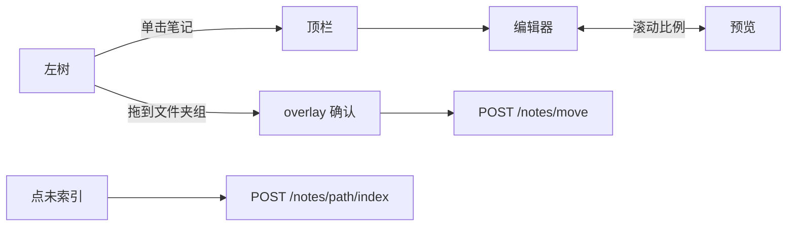

# 前端（现行界面）

> 以 [`home.html`](../../src/noteagent/web/templates/home.html) 为准。全局职责见 [architecture.md §5.1](./architecture.md#51-前端)。  
> 聊天工具与人审卡片字段见 [chat-tools.md](./chat-tools.md)。  
> 磁盘与向量同步见 [retrieval.md](./retrieval.md)。

| 项 | 内容 |
|---|---|
| 形态 | 单页，无独立前端工程、无 Vue/React 打包 |
| 下发 | `GET /` 与 `GET /documents` 都返回同一 `home.html`；`read_home_html()` 每次读盘 |
| 视图 | 顶栏切 Chat / Documents；用 `pathname` + `history.pushState` |
| 分区 | 聊天脚本不复用 Documents 弹窗 DOM；笔记路由不经过 Agent |

---

## 1. 范围与原则

一张 HTML 里两套主界面，CSS/JS 写在同一文件，但**业务不要串**：

1. **Chat 不管磁盘。** 侧栏是 PostgreSQL 会话。Agent 改笔记只通过右侧面板的草稿模式 → `POST /chat/review`；在面板里改草稿正文走 `PUT /chat/draft`，只改待审状态。点 ① 打开的出处侧栏是人类写盘，走与 Documents 相同的 `PUT /notes/{path}`（无删除、无预览）。
2. **Documents 不调模型。** 树、编辑、入库只打 `/notes*`。保存/新建/移动/删除都是人类操作，与聊天审批并列，都算「人写盘」。
3. **工具过程单独一排。** 进行中英文当前步可闪烁（ing + `...`），live 也可点 ▼ 看步骤；写回答时为 Generating...。有工具则结束后标题为 Explored N files；无工具则隐藏过程排。步骤完成后改成 Thought / Read / Searched。有正文的 Thought 可展开。主气泡仍是最终 `assistant` 正文。Documents 树不显示 Agent hop。
4. **不建笔记表。** 最近修改用文件 `mtime`；已/未索引看 Chroma 有没有该相对路径的点。
5. **一层目录。** 树上文件夹与根目录 `.md` 同级；文件夹内笔记再缩进。根文件仍是 `notes/*.md`，不造磁盘上的「未分类/」。

Python 只负责读模板。业务规则在 `home.html` 的 fetch 与后端路由，不在 `web/` 里再包一层 API client。

---

## 2. 整页骨架

```text
┌──────────────────────────────────────────────┐
│ NoteAgent     Chat | Documents               │  .app-nav
├────────────┬─────────────────────────────────┤
│            │                                 │
│  左栏      │  主区（#viewChat 或 #viewDocs）  │  .app-shell
│  .sidebar  │                                 │
│            │                                 │
└────────────┴─────────────────────────────────┘
```

两个 `.app-shell` 同时在 DOM 里，用 `.active` 显隐。默认 Chat（`GET /`）。`GET /documents` 或点顶栏后 `showView("documents")`。

| 区域 | Chat | Documents |
|------|------|-----------|
| 左栏宽 | `--sidebar-width` 260px | `#viewDocs .sidebar` 约 300px |
| 左栏头 | 会话 | 笔记 |
| 左栏底 | 新对话 | 新建笔记、新建文件夹 |
| 主区顶 | 「学习笔记助手」 | 笔记名 + 未保存点 + 索引芯片 + mtime |
| 主区中 | 气泡（与输入同宽） | 工具条保存/删除；中编辑、右预览 |

Chat 的会话删除 overlay（`.modal-overlay` + `deleteOverlay`）与 Documents 的 `#docsOverlay` **分开**，避免两套菜单抢同一个节点。

---

## 3. Chat 布局（简述）

左：会话列表、三点重命名（行内 input）/删除（overlay）。中：欢迎语或气泡（与底栏输入框同宽，栏宽取 768 与满宽的中点，助手/用户左右边距对齐）。底：输入框，Enter 发送、Shift+Enter 换行。

进页 `GET /conversations`；点会话 `GET /conversations/{id}/messages` 画气泡，再 `GET /conversations/{id}` 把 `pending_draft` 送进右侧面板的草稿模式。发一句立刻画 user 气泡和空 assistant。读 SSE：`conversation` → `thinking` / `think` / `tool` / `tool_done` / `generating`（过程排 live 也可展开；当前步英文闪烁）→ `token`（marked，并把该条消息内的 `[[cite:N]]` 绘成蓝色上标 ①，编号按该条首次出现为 1..n）→ 可选 `sources` / `draft`。结束后有工具则为 `Explored 2 files, 1 search` 这类英文汇总 + ▼；无工具不留过程排。点 ① 时聊天区收窄，右侧 textarea 打开该笔记（无预览）；检索片段用选区定位。切到另一个会话时侧栏按 `conversation_id` 快照（含未保存缓冲），互不顶替；关页或进 Documents 时若有未保存出处再确认。保存/Ctrl+S 走 `PUT /notes/{path}`，与 Documents 一样先删旧向量再整篇索引。关闭、Escape、切到 Documents 时若未保存先确认。无删除。`isStreaming` 时不能连发。

审批区在同一个右侧面板里，不占用聊天气泡。`draft` SSE 与恢复会话都打开面板的草稿模式：徽标「待审批草稿」，标题为「动作 · 目标文件」，同一个 textarea 显示并编辑草稿正文，textarea 下方是确认语与常驻的 保存草稿 / 同意追加·覆盖·删除·新建 / 更多操作 / 拒绝。覆盖方式收进「更多操作」菜单（追加到笔记、新建笔记），选中后只渲染那一种表单（追加的目标选择或新建的文件名输入），两个表单不会同时占位；菜单用 `aria-haspopup` / `aria-expanded`，打开时焦点进菜单，Escape 只收菜单并把焦点还给触发器，不会顺手关掉面板。create 与 append 才有「更多操作」，replace 与 delete 没有（与改动前的卡片一致，没有静默移除入口）；delete 无正文，正文为空时保存按钮禁用。草稿编辑只改 `conversations.pending_draft`（`PUT /chat/draft`），**不写 Markdown**；批准/拒绝时若正文未保存，先保存成功再 `POST /chat/review`，保存失败不审批旧版本。审批或拒绝成功后清掉该会话的草稿模式：本会话没有引用内容就关闭面板，有引用则回到引用模式。两种模式共用 textarea，同一时刻只显示一种，模式与缓冲随 `conversation_id` 快照；被引用面板以外的会话收到的草稿不写可见面板，切回该会话时由 `GET /conversations/{id}` 恢复。请求进行中常驻按钮、菜单项与表单提交一起禁用，避免重复提交。

草稿字段与动作语义见 [chat-tools.md](./chat-tools.md)。

### 3.1 三栏调宽

Chat 分三栏：左会话列表、中聊天区、右笔记/草稿面板，两栏之间各有一条可拖分隔线（`#conversationResizeHandle`、`#notePaneResizeHandle`，共 8px 命中区，视觉仍是 1px 边界，hover/focus 时变强调色）。中间区始终吃剩余空间，**只持久化左右两栏宽度**，不存一个会互相矛盾的中间宽度。

- 持久化键 `noteagent.chat-layout.v1`，存 `{sidebarWidth, notePaneWidth}`；只在拖动结束与键盘调整后写入，不在每次 `pointermove` 里写。默认 260 / 400。
- 范围：左栏 200–400、右栏 300–600，中间区尽量不少于 440。边界随视口收紧：先压右栏，再压左栏（950px 以下中间区可小于 440），窗口连两栏最小值都放不下时两栏按最小值保留、中间区可被压到 0，页面不产生横向滚动。
- 读取时只接受范围内的有限数值；缺失、非数字、越界或 `localStorage` 不可用都回退默认，恢复后仍按当前视口重新 clamp。窗口 resize 只重新收边，不改已保存的意图，也不写存储。
- 拖动用 Pointer Events + `setPointerCapture`（鼠标 / 触控笔 / 触摸同一套），`pointerup` 与 `pointercancel` 都收尾并清理临时 class 与 `user-select`。分隔线是 `role="separator"` + `aria-orientation="vertical"` + 动态 `aria-valuemin/max/now`，可聚焦：方向键 ±10px、Shift ±40px、Home/End 到该栏边界。
- 右侧面板隐藏时它的分隔线一起隐藏（`MutationObserver` 跟随面板 `hidden`）。
- 分隔线只存在于 Chat 视图内，宽度通过 `#viewChat` 上的 `--sidebar-width` / `--note-pane-width` 生效；Documents 侧栏仍走自己的 300px 规则，不读也不被 Chat 布局影响。

用户气泡 `.msg-row.user .msg-body` 为 `pre-wrap`；助手走 marked。

### 3.2 模型入口（输入框下方右侧）

聊天模型与本地向量模型两个入口固定在输入框下侧靠右（`.model-toolbar`，`justify-content: flex-end`，窄屏换行）。功能区只在 Chat 输入栏，不挤占 Documents 编辑器。

弹层向上展开在**整个输入区之上**（`.input-area` 为定位基准），不遮挡输入框、发送按钮与引用面板。Escape 或点击功能以外区域关闭，焦点回到触发按钮；按钮 `aria-expanded` / 弹层 `role="dialog"`；长模型名省略显示，`title` 给全名。

| 入口 | 内容 | 动作 |
|------|------|------|
| 聊天：模型名 ▾ | 已保存 profile 列表（provider、model、凭据来源、Base URL、上下文窗口） | 「启用」走验证事务；「编辑」回填表单；非当前项有「删除」（confirm 后 `DELETE`，带上当前 revision）；「＋新增配置」 |
| 向量：模型名 ▾ | 服务端候选（`availability` + `reason`） | 可用项「重建并切换」；**当前模型但索引不可用**时按钮变「重建并修复」并标「索引不可用」；不完整项禁用并显示原因；索引正常时标「已启用」 |

表单字段：配置名称、provider、模型名、Base URL（提示填服务根地址，不要填 `/chat/completions`）、API Key（password，编辑时留空表示保留）、该服务无需 API Key（仅 deepseek 以外）、清除已保存的 Key（与填新 Key 互斥，勾选后 Key 输入禁用）、上下文窗口。按钮是「测试连接」「保存」「保存并启用」「取消」。**「保存」只在编辑非当前启用的配置时出现**：编辑当前启用的配置只能走「保存并启用」，因为只改文件而不更换运行中的客户端会让界面与服务端不一致。无论哪种提交，密码框永不回显 Key，列表只显示「已保存 Key / 无需 Key / 凭据来自环境」。

聊天弹层的错误与成功提示只写聊天弹层的状态区（`showError` / `showOk`），向量相关的提示只写向量弹层自己的状态区（`showEmbeddingError` / `showEmbeddingOk`）；两个弹层不串消息。

向量弹层底部的状态行直接由 `retrieval_state` 决定：`missing` / `config_mismatch` / `unavailable` 显示可操作的原因（并给出重建入口），`empty` 且笔记目录非空时提示「索引里还没有任何片段……可能需要重建」（黄色提示，不阻断），`empty` 且目录为空时说明这是正常状态，`ok` 时显示「已索引 N 个片段，覆盖 M 篇笔记」。重建进行中不显示这一行，由进度条说明情况，避免两处状态互相矛盾。

向量切换期间（维护窗口）：

- 进度条按 `stage` 显示（排队中 → 加载模型 → 建立索引 → 校验索引 → 发布切换），每 1 秒轮询 `GET /model-settings/jobs/{id}`；任务结束、页面隐藏或视图退出即停，刷新页面用 `GET /model-settings` 的 `embedding_job` 恢复展示。
- 发送、审批（同意/覆盖）、Documents 保存/删除按钮禁用，输入框底部提示「向量索引重建中：暂时不能发送消息或保存笔记，已有内容仍可查看」。禁用状态只**叠加**在原有「空输入」「未保存 dirty」判断之上，不覆盖它们。
- 失败或中断时显示旧模型仍生效，并提示可以再点一次重试（新任务有新 id，旧 active 不变）；后端拒绝（409）时保留用户输入与未保存正文，发送被拒时把清掉的输入还原（仅在输入框仍为空时，不覆盖随后输入的新文字）。
- 生成中禁用两个入口；本轮结束前不切换。

**发送互斥门闩。** `ask()` 在任何 `await` 之前同步置位 `isStreaming`，第二次调用立即返回。这样「双击发送」或「Enter 连按」只产生一次 `/chat` 请求、一条用户消息；`finally` 里释放，异常与取消路径同样释放，失败（例如 409）时把问题文本还给输入框后仍可重新发送。历史的写法是先 `await refreshIfStale()` 再置位，双击会在那个 await 期间双双通过检查。

页面接口（`web/static/model-settings.js` 的 `ModelSettings`）：`init()`、`setStreaming(bool)`、`canSend()`、`refreshIfStale()`、`onBusyChange(fn)`。多标签页在窗口 focus、发送前、保存前刷新状态（`refreshIfStale` 以 5 秒为界）。

样式与脚本外置在 `web/static/`，由 `create_app` 显式 `app.mount("/static", StaticFiles(...))`；模板不会自动提供静态资源路由。

---

## 4. Documents 布局

```text
┌────────────┬─────────────────────────────────────────┐
│ 笔记        │  顶栏：basename（略大） · 未保存点        │
│            │        绿/灰芯片    最近修改 mtime        │
│ v bak/  2 …│ ─────────────────────────────────────── │
│     a.md 已│  [保存] [删除]                            │
│  Go.md  未│ ─────────────────────────────────────── │
│            │  textarea 编辑 │  marked 预览            │
│ ＋新建笔记  │  （滚动比例同步）│                         │
│ ＋新建文件夹│                                         │
└────────────┴─────────────────────────────────────────┘
```

### 4.1 树

- **先文件夹、后根笔记**，各自按名排序。
- 文件夹行：展开箭头、文件夹图标、名称、篇数、三点。点箭头只展开/折叠；点其余部分选中该文件夹（决定新建笔记落点）。
- 子笔记相对文件夹缩进一档，包在 `.docs-folder-group` 里。
- 根目录笔记与文件夹同一缩进，文件图标 + basename + 芯片 + 三点。
- 打开中的笔记：左强调条 + 行背景。长文件名省略号，`title` 出相对路径。

选中真实文件夹（或其中一篇笔记）时，「新建笔记」进该文件夹；选中根笔记或未选中则进根目录。

### 4.2 芯片

| 状态 | 样子 | 点击 |
|------|------|------|
| 已索引 | 绿底 `.status-chip.on` | 无 |
| 未索引 | 灰底 `.clickable` | `POST /notes/{path}/index`，文案「入库中…」 |

树行与顶栏共用同一套逻辑。点芯片 `stopPropagation`，不打开、不拖拽。空文件切不出块则仍显示未索引。索引失败不回滚 Markdown。

### 4.3 三点与弹窗

`#docsOverlay`：标题、正文、**仅重命名/新建时显示**的输入框、取消/确认。

`.modal-input { display: block }` 会盖掉 HTML `hidden`，必须同时有 `.modal-input[hidden] { display: none }`，否则移动/删除确认框中间会露出空输入框。

| 操作 | 输入框 | 危险按钮 |
|------|--------|----------|
| 新建笔记 / 文件夹 | 有 | 否 |
| 重命名笔记 / 文件夹 | 有 | 否 |
| 移动确认、删除、未保存切换 | 无 | 删除为是 |

缺 `.md` 时仓库会补。删文件夹确认文案含篇数，并说明将清向量。

工具条「保存」「删除」保留；树三点另提供重命名/删除。已去掉「移动到所选」下拉。

### 4.4 拖拽移动

只拖笔记。按下后移动超过约 6px 视为拖拽，避免和单击打开冲突。

落点：

- 文件夹组（展开时含其下笔记整块）→ 移入该文件夹；整块灰底 `.docs-folder-group.drop-target`（`#e5e7eb`）。
- 根笔记或树空白 → 移回根目录。
- 目标已是当前目录则不问。

松手后 overlay 确认，再 `POST /notes/move`。不拖文件夹。

### 4.5 顶栏、编辑、预览

点开笔记：立刻填 textarea 与右侧预览。顶栏只显示 **basename**（字号大于正文）、未保存圆点、芯片、本地时间 mtime。**不显示相对路径。**

`Ctrl+S` / `Cmd+S` 在 Documents 且无弹窗时保存。切笔记、离开 Documents、关页面前若 `docsDirty` 则询问。

左右按 `scrollTop / (scrollHeight - clientHeight)` 同步，用锁防回声。不按标题精确对齐。

---

## 5. Documents 请求



| 方法 | 路径 | 页面何时打 |
|------|------|------------|
| GET | `/notes` | 进 Documents、树刷新 |
| GET | `/notes/{path}` | 打开一篇 |
| POST | `/notes` | 新建笔记（随后入库） |
| PUT | `/notes/{path}` | 保存正文（随后重建向量） |
| DELETE | `/notes/{path}` | 删一篇 |
| POST | `/notes/{path}/index` | 点「未索引」 |
| POST | `/notes/folders` | 新建文件夹 |
| POST | `/notes/folders/rename` | 重命名文件夹并重索引其下每篇 |
| DELETE | `/notes/folders/{name}` | 删文件夹内全部笔记和向量 |
| POST | `/notes/move` | 拖拽或同目录重命名 |

`DELETE /notes/folders/{name}` 必须注册在 `DELETE /notes/{path}` **之前**，否则会被当成删 `folders/Lang.md`。

成功 INFO 在 `noteagent.notes.router`（`notes http create/save/move/delete/index/folder *`）。切块步骤仍走 `IndexTrace`。

维护窗口内这些写接口返回 409（`code=busy`），消息结构与「不泄露凭据」见 [retrieval.md](./retrieval.md) 与 [../plans/2026-09-25-model-switching-ui.md](../plans/2026-09-25-model-switching-ui.md)；前端用 `errorMessage()` 统一读 `message` / `detail`。

---

## 6. 两条写盘路径（不要混）

```text
Chat 审批     POST /chat/review  → drafts.commit_review → notes + Chroma
Chat 草稿正文 PUT /chat/draft    → conversations.pending_draft（不写盘、不索引）
Chat 出处侧栏 PUT /notes/{path}  → notes.router（与 Documents 保存相同；无删除）
Documents     /notes*            → notes.router         → notes + Chroma
Agent 工具    propose_note       → conversations.pending_draft，不写盘
```

同一 `FileNoteRepository` 与 `RetrievalService.index_note` / `delete_note`。聊天侧日志是 `draft indexed`；Documents 侧是 `notes http *`。失败都不回滚 Markdown。

未在 Documents 打开过、也从未审批/点芯片的旧文件，树上显示未索引，点灰芯片或跑 `scripts/index_notes.py` 才会进库。

---

## 7. 刻意不做

多层目录、拖文件夹、点「已索引」再入库、按标题精确同步滚动、独立 SPA、暗色整站、笔记元数据表。

---

## 8. 代码落点

| 文件 | 内容 |
|------|------|
| [`web/templates/home.html`](../../src/noteagent/web/templates/home.html) | 布局、样式、Chat/Documents JS；模型入口按钮与页面接线 |
| [`web/static/model-settings.js`](../../src/noteagent/web/static/model-settings.js) | `ModelSettings`：状态轮询、聊天表单、向量候选与进度 |
| [`web/static/model-settings.css`](../../src/noteagent/web/static/model-settings.css) | 工具栏、弹层、表单、进度与错误样式 |
| [`web/__init__.py`](../../src/noteagent/web/__init__.py) | `read_home_html()`、`STATIC_DIR` |
| [`chat/router.py`](../../src/noteagent/chat/router.py) | `GET /`、`GET /documents`、会话与聊天 HTTP |
| [`notes/router.py`](../../src/noteagent/notes/router.py) | Documents 笔记 HTTP |
| [`model_management/router.py`](../../src/noteagent/model_management/router.py) | `/model-settings*`，并导出请求级租约依赖 |

包说明：[`web/README.md`](../../src/noteagent/web/README.md)、[`web/templates/README.md`](../../src/noteagent/web/templates/README.md)、[`model_management/README.md`](../../src/noteagent/model_management/README.md)。
