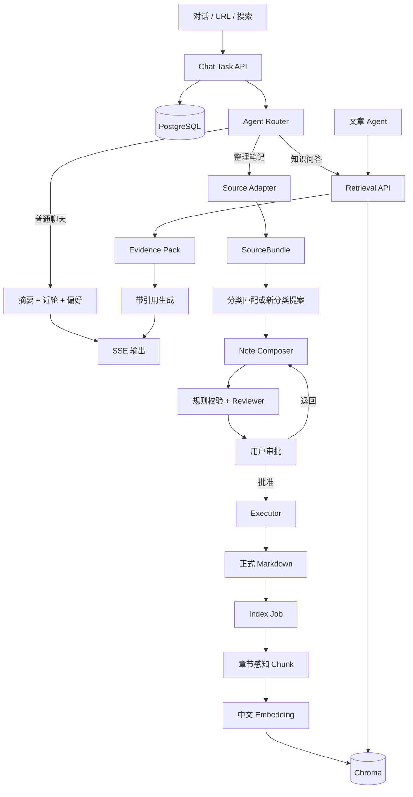

# NoteAgent 知识基础设施 v1（已确认）

> 日期：2026-08-17  
> 状态：架构基线，尚未按本文实现  
> 定位：文章生成工作流中的知识子系统，不是完整知识产品

本文是后续实现和给 AI 编码的主文档。旧文件 `docs/architecture/architecture.md`、`docs/architecture/DESIGN.md` 描述的是屏幕/OCR 方案，与当前代码和本文不一致，实现时以本文为准。

> 聊天展示历史已落 PostgreSQL（`noteagent.db`，见 `docs/plans/2026-08-20-chat-history-persistence.md`）。模型上下文仍在内存，重启后 UI 有历史但不会自动带上旧轮次。

可视化画布（与本文一同放在本目录，随仓库保存）：

- [noteagent-architecture.canvas.tsx](./noteagent-architecture.canvas.tsx)
- [noteagent-system-workflow.canvas.tsx](./noteagent-system-workflow.canvas.tsx)

---

## 1. 系统定位

NoteAgent 做两件事：

1. 把对话、明确 URL、Agent 搜索结果整理成高质量中文笔记，经人工审批后写入本地 Markdown。
2. 将已审批笔记自动索引，通过 Retrieval API 提供带引用的检索，供本系统问答和下游文章 Agent 使用。

原则：先保证知识可信，再保证检索，最后才优化聊天 UI。  
LLM 只产出结构化提案；写目录、写文件、改索引由确定性代码执行。

---

## 2. 端到端工作流

```text
用户输入（中文对话 / URL / 搜索主题）
→ 消息先写入 PostgreSQL
→ Agent Router：普通聊天 | 笔记任务 | 知识问答
→ 笔记任务：Source Adapter 形成 SourceBundle
    Direct：规范化所选消息
    URL：Fetch 指定页（不另选来源）
    搜索：规划查询 → 筛选来源 → Fetch 入选页
→ 分类匹配或提出新分类
→ Note Composer：source-only 生成中文结构化草稿
→ 程序校验 + 独立 Reviewer
→ 用户审批 KnowledgeChangeSet（内容 / 分类 / 来源 / Diff）
    退回 → 回到 Composer
    批准 → Executor 原子写入 Markdown + 版本
→ Index Job：H2/H3 章节感知 Chunk（过长按段落拆、过短合并）
→ BGE-small-zh-v1.5 Embedding
→ Chroma 增量 upsert
→ Retrieval API 可检索
```

状态机（每个 IngestionJob）：

```text
SUBMITTED → FETCHED → CLASSIFIED → DRAFTED
→ PENDING_REVIEW → APPROVED → COMMITTED
→ INDEX_PENDING → INDEXED
```

失败单独记录（如 `FETCH_FAILED`、`INDEX_FAILED`），从对应阶段重试。  
Markdown 已提交但索引失败：只重试索引，不重新审批，不回滚笔记。



---

## 3. 存储边界

| 存储 | 职责 |
|------|------|
| PostgreSQL | 会话、消息、IngestionJob、审批、分类目录、偏好、审计；LangGraph PostgresSaver |
| Markdown | 正式知识事实源，人类可读、可迁移 |
| Chroma | 由已审批 Markdown 派生的向量索引，可删除重建 |
| 网页正文 | 仅工作流期间临时使用，写入成功后丢弃 |

不把聊天摘要写入 `notes/context.md`，不把未审批草稿送进 RAG。

稳定身份：`ingestion_id`、`note_id`、`note_version`、`category_id`、`source_content_hash`、`chunk_id`、`chunk_hash`。  
目录路径可变，不能当唯一 ID。ChangeSet 等半结构化字段用 JSONB。

---

## 4. 聊天与记忆

形态：普通对话 Agent，主能力是笔记整理。会话可切换、可恢复。任务卡片嵌在会话时间线中。同一会话可派生多个 Job，建议同时只活跃一个。

四层拆开：

| 层 | 发给模型 | 进 RAG |
|----|----------|--------|
| 完整聊天历史（PostgreSQL） | 否 | 否 |
| 运行上下文：滚动摘要 + 近轮 + 当前任务工作区 + 少量偏好 | 是 | 否 |
| 用户偏好（轻量） | 短 | 否 |
| 已审批笔记 | 仅问答经 Retrieval API | 是 |

LangGraph checkpoint 不是聊天库。用户可见历史从 PostgreSQL 读。  
偏好：用户明确强调的全局规则才写入（例如「不要用一级标题」），不做越聊越长的记忆流水账。偏好只影响整理风格，不能写入笔记正文当事实。

---

## 5. 笔记与质量

- 一篇来源对应一篇正式 Markdown（搜索任务可为一篇多来源综合笔记）。
- 统一 frontmatter + 按类型选正文模板。
- source-only：只依据选定来源；推论必须标明；冲突并列。
- 英文网页由 Composer 直接写成中文笔记，MVP 不加翻译模型。专有名词可保留中英对照。
- 不长期保存网页全文；保留 URL、标题、作者、`fetched_at`、`source_content_hash`。
- 三层质量门：程序校验 → 独立 Reviewer → 用户审批。
- LLM 不直接 `mkdir` / 写文件。新分类必须进 ChangeSet 由用户批准，Executor 创建目录并更新 Taxonomy。

---

## 6. MVP 检索

```text
Query Embedding
→ 向量 Top-K（建议先召回 8）
→ 相似度阈值（用 10–20 条中文查询标定，配置化）
→ 每篇笔记最多 2 个命中 Chunk
→ 相邻 Chunk 展开
→ token 预算裁剪
→ 返回内容与引用
```

无可靠证据时返回 `insufficient_evidence`，禁止用无关近邻硬答。  
后期在 Retrieval API 内加关键词召回和 rerank，不改上层契约。

Chunk：按 Markdown 二、三级标题；过长按段落和长度拆；过短与相邻合并；携带完整 `heading_path`。  
Embedding：`BGE-small-zh-v1.5`。记录 `chunking_version`、`embedding_model_version`、`note_version`。

RetrievalResult 至少包含：`content`、`note_id`、`note_version`、`title`、`category_id`、`topic_path`、`tags`、`file_path`、`heading_path`、`source_urls`、`score`、`citation`。

---

## 7. 实现约束（给 AI）

职责：LLM 只返回结构化提案；Service/Repository 执行文件、版本和索引。API 不直接操作向量库内部结构。  
幂等：副作用带 `ingestion_id`、`note_id`、`note_version`、`content_hash`。  
安全：网页是数据不是指令；Collector 无写文件权限。  
编排：LangGraph interrupt/resume/retry；`Job.status` 以 PostgreSQL 业务表为准。

建议实现顺序：

1. PostgreSQL + SQLAlchemy/Alembic 表与迁移  
2. 会话与消息持久化；去掉退出时写 `context.md`  
3. SourceBundle / NoteDraft / KnowledgeChangeSet 与 Job 状态机  
4. LangGraph 可恢复编排  
5. 审批 API 与确定性 Markdown Executor  
6. 自动 Chunk、中文 Embedding、增量索引  
7. 带阈值、去重、邻居展开和引用的 Retrieval API  
8. 10–20 条人工查询评估集  

MVP 不做：多用户权限、微服务、专用翻译模型、混合检索、rerank、自动知识合并、复杂长期记忆。
