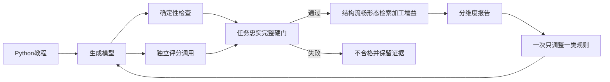

# 学习型笔记质量体系改善计划

## 目标

建立面向“长篇教程 / 技术文章 → 中文学习型笔记”的质量标准、混合评分与提示词迭代闭环。第一期以 Python 教程 `Whetting Your Appetite` 为验收样本，证明新体系能区分优秀学习笔记、机械译文、遗漏摘要和幻觉笔记。

本期不实现通用 `TaskSpec`、`RecordProfile`、屏幕 / OCR 输入或独立 Composer。

## 质量定义

“良好”先过三道硬门：

1. 任务匹配；
2. 事实忠实；
3. 语义完整。

任一道失败都不得被结构或文笔高分抵消。过门后继续评价原有的结构、流畅、形态、可检索，并新增“知识加工增益”：

- 0：逐句照译；
- 1：只有措辞或格式变化；
- 2：完成基本语义分组与去重；
- 3：显式呈现因果、对比或递进；
- 4：形成无需重新解析原文的学习结构。

技术事实、命令、代码和数字可以贴近原文；加工增益只要求说理、背景、动机和比较内容得到实质组织。事实、模态、条件、例外和关键语义单元受约束，措辞、句序、段落、标题和表现形式允许重组。不得自行补充外部背景知识。

## 实施步骤

### 1. 发布 v0.2 学习型笔记尺子

- 修改 `docs/evaluations/note-quality.md`：
  - 忠实改为“草稿命题可由原文支持”；
  - 完整改为“关键语义单元覆盖”；
  - 结构改为“顶层范围保留 + 有依据的语义重组”；
  - 新增知识加工增益 0–4 档；
  - 明确 v0.1 与 v0.2 不直接比较。
- 保留显式提纲、节选和完全忠实翻译的旧任务边界。

### 2. 建立 Python tutorial 校准集

- 新增 `evals/prompt/learning_notes.jsonl`，第一期只放 `Whetting Your Appetite` 主验收材料。
- 扩展 `EvalCase`，支持任务类型、输出语言、必需语义单元、必需关系、模态 / 例外、禁止命题、复习问题和质量阈值。
- 准备四类固定候选：
  1. 优秀结构化学习笔记；
  2. 当前逐段译文；
  3. 可读但遗漏严重的摘要；
  4. 含无来源结论的“丰富笔记”。
- 固定排序契约：优秀笔记 > 机械译文 > 遗漏摘要；幻觉候选必须被忠实硬门淘汰。

### 3. 实现混合评分

- 保留路径、锚点、代码围栏等确定性检查。
- 学习型任务不再因新增有依据的语义标题直接扣分，也不使用字符压缩比或句子边界重合度判断加工质量。
- 新增 Judge 模块和评分提示词，结构化返回事实支持、语义覆盖、逻辑关系、0–4 质量维度以及原文 / 草稿证据。
- Judge 使用与生成模型相同的模型接口，模型名独立配置。若两者模型名相同，报告必须标记 `judge_independent=false`，不得把结果描述为独立校准。
- Judge 缺失或解析失败时标记“未完成”，不得把未评语义项摊权后生成虚高总分。
- 所有 LLM 评分请求记录模型、Prompt hash、耗时和错误，不记录密钥。

### 4. 校准后优化生成 Prompt

- 先用固定四候选校准评分器，再修改生产 Prompt。
- 默认“整理成笔记”改为学习型笔记；只有用户显式要求完全忠实翻译时才保持原结构。
- 材料标题用于来源覆盖和章节边界，不再全局禁止增加语义子标题；翻译任务允许翻译标题并保留编号。
- 每版生成 Prompt 存入 `src/noteagent/chat/prompts/iterations/`；每个评测结果必须记录该版解决的问题、仍存在的问题、Prompt hash、生成模型与 Judge 配置。
- 固定评测集、评分标准、Judge Prompt 和 Judge 模型，只改变生成 Prompt，保证分数变化可以归因。

### 5. 验证

- 优秀候选：通过全部硬门，结构、流畅、加工增益均不低于 3/4。
- 当前逐段译文：通过忠实与完整，但因加工增益不足不得整体合格。
- 遗漏摘要：完整硬门失败。
- 幻觉候选：忠实硬门失败。
- 候选生产 Prompt 生成的 Python 教程笔记必须通过全部硬门，结构、流畅、加工增益均不低于 3/4，并能仅依据笔记回答预设复习问题。
- 运行定向单元测试与完整 `pytest -q`；单样本通过只代表第一阶段验收，不宣称已对所有教程泛化。

## 排除项

- 不以 BLEU、ROUGE、文本长度、标题数量或句子边界重合度代替语义质量判断。
- 不允许用无来源背景知识制造“内容更丰富”的假象。
- 不让生成 Prompt 与 Judge Prompt 同时变化。
- 不根据一次结果连续堆叠多类提示词修改。
