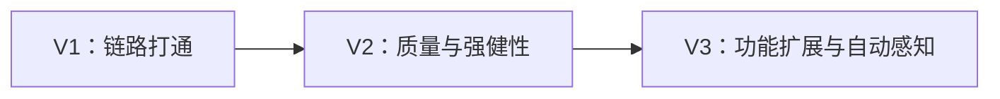
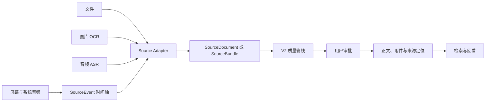
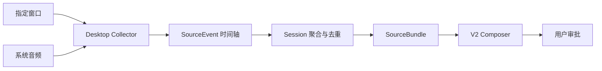

# NoteAgent 版本迭代要求

本文规定 NoteAgent V1–V3 的产品目标、阶段问题、功能范围和验收要求。它回答“每一代要解决什么”，不替代现行架构说明和具体实现计划。

- 上层业务与术语：[产品与业务架构](../product/business-architecture.md)、[CONTEXT.md](../../CONTEXT.md)
- 当前系统结构：[architecture.md](../architecture/architecture.md)
- 生成、Agent 与 RAG 评测：准则 [docs/evaluations/](../evaluations/README.md)；黄金集 [evals/](../../evals/README.md)
- 具体实现任务：[plans/](../plans/README.md)

---

## 1. 产品目标

NoteAgent 帮助用户将接触过的内容，按自己的要求记录、整理为有来源、可核对、可检索、可再次加工的个人材料。学习、网页阅读、视频操作记录和会议记录复用同一条业务链：

1. 用户指定记录对象、范围与整理要求；
2. 获取内容，保留来源及位置；
3. 按要求整理成可核对的草稿；
4. 经用户确认保存为可复用材料；
5. 在后续问题或任务中检索、回看依据并再次加工。

笔记是材料的一种形态。V1 以聊天文字笔记为起点；远期能力按场景逐步增加，不要求在第一版实现全部对象与输入类型。

产品演进对应三个成熟度：



- **V1：能记、能存、能搜。**
- **V2：记得准、搜得准；文字与网页有依据，整理要求可复用，出错可恢复。**
- **V3：按场景获取多模态内容，形成可定位、可回看的材料并再次利用。**

所有版本继续遵守现行核心边界：

- Markdown 是当前正式文字笔记的事实源；多模态阶段还需保存必要附件、来源定位与版本信息；
- LLM 生成提案，正式材料由确定性代码在用户确认后写入；
- 自动生成的材料变更必须经用户审批；Documents 等直接编辑保存属于用户操作；
- 用户授权范围内可以持久化来源和采集检查点，它们不因此成为已确认材料；
- Chroma 是可重建的派生索引；
- 版本是否完成由验收结果决定，不由“代码已经写了”决定。

### 1.1 版本含义与业务交付

V1/V2/V3 是产品能力阶段，V1.0 等是交付里程碑，不等同于 `pyproject.toml` 的包版本或 Git 发布 Tag。下文的功能要求是目标，不是现状清单。

| 阶段 | 用户可完成的完整任务 | 完成边界 |
|------|----------------------|----------|
| V1 | 输入文本、审批笔记、在后续对话中检索 | V1.0–V1.4 要求及退出标准均有验收证据 |
| V2 | 按可复用要求整理文本和指定网页，保存后可追溯、可检索、可恢复 | V2.1–V2.6 要求及质量门槛有报告；任意网页和通用 Agent 编辑器不在范围内 |
| V3 | 记录文件、图片、会议录音及视频/区域内容，检索时回看对应来源，组合材料产生新草稿 | V3.1–V3.5 分别验收；单一场景试点只声明该场景完成 |

### 1.2 每个小版本的交付约定

开始实现前在对应计划中写清：用户场景、支持的输入与范围、整理结果、保存与复用行为、失败恢复、排除项、评测集和验收门槛。来源格式、平台、时长与容量等支持边界必须明确，不能用“支持视频”代表任意视频环境。

完成验收需要三类证据：

1. 正确性：权限、范围、写入、删除、重复请求等确定性行为的测试。
2. 质量：固定样本上的生成、检索和定位报告；声明数据集版本、模型配置、统计口径与失败样例。
3. 业务：从指定输入到确认保存，再在新会话或任务中检索回看的可重复演示。

已有样例数量不代表质量达标。数值门槛在评测前固定；若需调整，记录原因并重新验收，不能通过删难例或临时改门槛宣布完成。临时技术验证可以早于阶段验收，后续版本正式验收不能省略前置闭环。

### 1.3 当前状态与证据边界

以下依据现行文档与已有评测记录整理（2026-09-22，**2026-09-25 补入 RAG 评测线的一手结果**），不是本次重新运行全部测试后的认证。状态使用“规划、实现中、待验收、已验收”；阶段状态以全部必需交付的证据为准。RAG 相关的数字与失败样例见 [rag-v1-report.md](../evaluations/rag-v1-report.md)。

| 范围 | 状态 | 依据与缺口 |
|------|------|------------|
| V1.0–V1.3 | 待验收 | [现行架构](../architecture/architecture.md) 描述主要组件已存在；需汇总对应自动测试与端到端结果 |
| V1.4 | 待验收（剩手动功能验收） | **RAG 查询集缺口已闭合**：40 条带证据标注的查询（dev 24 / holdout 16）+ 20 条 Agent 场景、可重复的评测入口与真实基线（[rag-v1-report.md](../evaluations/rag-v1-report.md)，2026-09-25）；**生成样例已补齐并实跑**：25 条 g01–g25 全量生成验收行为门与内容审查 25/25、自动测试 478 passed（[v1-acceptance-report.md](../evaluations/v1-acceptance-report.md)，2026-09-26）；仍缺：手动功能验收（用户执行）与端到端闭环演示 |
| V2.1 评测基线 | 证据已就绪 | 笔记正文 v0.2 + 检索（Recall@5/Hit@3/MRR/引用可追溯/调用率）+ Agent 轨迹三层都有固定数据集与入口；检索与 Agent 两层都在 dev 与 holdout 上跑过对照 |
| V2.2 生成质量 | **未达标** | l01 学习型样本改提示词为 v10 后连跑两次：`qualified=True`（结构 4/4、加工 3/4）与 `qualified=False`（加工 2/4），加工分卡在阈值 3；与 v9 相比无改善，不能宣布达标 |
| V2.3 RAG 准确率与引用 | 检索侧达标，引用与人工审查未完 | Recall@5 **dev 17/18、holdout 11/12**，Hit@3 同值，均过门槛；截断归零；无答案正确处理率 100%；引用可追溯率**文件级 100%、章节级 71%**（整篇 read_file 引用没有原文片段）；替换/删除后不命中旧证据有确定性测试；仍缺独立人工审查 |
| V2.4–V2.6 | 规划，部分基础已存在 | 当前有草稿持久化；网页任务、完整恢复和可保存整理方案仍按下文交付 |
| V3.1–V3.5 | 规划 | 屏幕旧稿与入库设想不作为实现证据 |

每次验收补充对应计划、测试命令及结果、评测报告和限制，再更新本表。长期学习清单 `TODO.md` 不作为产品版本进度依据。

---

## 2. V1：链路打通

### 2.1 主要问题

V1 要证明最短知识闭环成立：

```text
用户主动输入文本
→ Agent 理解对话
→ 生成笔记草稿
→ 用户审批
→ 写入 Markdown
→ 同步向量索引
→ 后续对话检索
```

这一代不追求最佳生成质量，也不接网页、文件、OCR、音频和屏幕。重点是模块能正确协作，数据不会绕过人审或写错位置。

### 2.2 V1.0：基础聊天

#### 要解决的问题

用户需要连续对话，刷新页面或切换会话后仍能看到历史；模型回复需要流式展示。

#### 功能要求

- FastAPI 提供单页聊天入口。
- `POST /chat` 使用 SSE 输出模型回复。
- PostgreSQL 保存 conversation 和 user/assistant message。
- 前端支持会话创建、列表、切换、重命名和删除。
- 未知会话在 SSE 建立前返回错误。
- 主气泡显示 user 与最终 assistant；工具过程可在独立区域显示，不混入正式回答正文。

#### 交付结果

用户可以创建多个会话，在侧栏切换并继续聊天；服务重启后历史气泡仍存在。

#### 验收要求

- 会话 CRUD 的单元或集成测试通过。
- 同一会话消息按创建顺序返回。
- 删除会话后相关消息级联删除。
- SSE 能输出 conversation id 和文本 token。
- 数据库不可用时应用明确启动失败，不进入半初始化状态。

### 2.3 V1.1：对话生成笔记

#### 要解决的问题

聊天回复不是长期知识。系统必须把需要保留的内容变成草稿，并阻止模型在用户确认前修改正式笔记。

#### 功能要求

- `list_files`：查看已有笔记名称。
- `read_file`：读取已有笔记，避免重复或错误覆盖。
- `propose_note`：提交 create / append / replace / delete 草稿。
- `DraftStore` 按 conversation 保存一份待审草稿。
- 前端以独立卡片展示草稿正文、目标文件和动作。
- `approve`、`reject`、`override` 进入确定性的 `commit_review`。
- 聊天 Agent 的提案只通过 `commit_review` 写入或删除；Documents 等用户直接操作通过自己的确定性入口保存并同步索引。
- 路径校验拒绝绝对路径、`..` 和嵌套目录。

#### 交付结果

用户明确要求记笔记时，可以先预览，再决定新建、追加、覆盖、删除或拒绝；普通聊天不会自动落盘。

#### 验收要求

- `propose_note` 本身不改变磁盘。
- reject 后磁盘不变。
- create / append / replace / delete 分别有测试。
- 写盘失败时草稿仍可继续审批，不静默丢失。
- 未经审批的正文不会进入 Chroma。

### 2.4 V1.2：对话短期记忆

#### 要解决的问题

模型需要理解“把刚才内容整理成笔记”，但不能无限携带全部历史和工具全文。服务重启后还要知道之前做过什么。

#### 功能要求

- 每次用户发送分配独立 `turn_id`。
- 模型输入由四层组成：
  - watermark 后的 Persistent History；
  - conversation 的 `running_summary`；
  - 当前 Turn 的 Runtime 工具全文；
  - DraftStore 的一行工作区提示。
- 每次工具结束后立即把 tool stub 写入 PostgreSQL。
- 工具完整输出只保留在当前 Turn 内存。
- 上下文达到阈值后，只按完整的已结束 Turn 压缩。
- 新摘要追加到旧摘要，watermark 指向最后一个已摘要的完整 Turn。
- 前端历史查询过滤 tool stub。

#### 交付结果

模型可以利用近期对话和当前工具输出完成多 hop 操作；下一 Turn 不会重复携带上一 Turn 的完整文件内容；重启后能从消息、stub 和摘要恢复。

#### 验收要求

- 当前 Turn 第二次模型调用能看到第一次工具的完整结果。
- 下一 Turn 看不到上一 Turn 的完整工具结果，只看到 stub。
- watermark 不得指向未完成 Turn。
- 压缩不删除早期消息行，前端仍可查看完整气泡历史。
- 长历史触发压缩后，当前用户消息和当前工具链保持完整。

### 2.5 V1.3：入索引与检索

#### 要解决的问题

笔记写入 Markdown 后，后续对话必须能检索到；覆盖或删除笔记后，旧向量不能继续返回过期内容。

#### 功能要求

- Markdown 按块切分并生成 embedding。
- Chroma 保存 chunk 向量和 `file_name` 等 metadata。
- 审批写盘成功后，按文件删除旧向量并重建当前索引。
- 删除笔记时删除对应向量。
- `search_relative_from_chromadb` 返回 top-k 片段供 Agent 使用。
- 保留手动单篇重建脚本，用于修复或验证索引。
- 索引失败记录日志，但不回滚已经审批的 Markdown。

#### 交付结果

用户批准一篇笔记后，可以在下一次对话中询问其内容；覆盖和删除不会长期遗留旧索引。

#### 验收要求

- create / append / replace 后 Chroma 内容与文件当前全文一致。
- delete 后按该文件查询不到旧 chunk。
- 重复重建同一文件不会无限增加重复点。
- 索引失败时 Markdown 保持已审批状态，日志包含文件名和错误。

### 2.6 V1.4：闭环验收

#### 要解决的问题

“各模块分别有代码”不等于产品闭环可靠。V1 需要一套最小基线，证明链路从用户输入一直走到后续检索。

#### 功能要求

- 增加文本闭环端到端场景：
  - 新建笔记后检索；
  - 追加后检索到新增内容；
  - 覆盖后不返回旧内容；
  - 删除后不返回该文件；
  - 拒绝草稿后文件和索引均不变。
- 验证重启后的会话和短期记忆恢复。
- 为生成和 RAG 建立最小人工评测基线。
- 记录一次闭环的工具调用顺序、耗时和失败位置。

#### V1 退出标准

- 核心闭环有可重复运行的自动测试。
- 至少 20 条笔记生成样例，覆盖普通对话、长文、英文材料、代码和修改已有笔记。
- 至少 20 条 RAG 查询，标注应命中的文件或章节。
- 明确输入一段文本后，能得到经审批的 Markdown，并在后续对话中检索到。
- 不要求生成质量已经最佳，但不允许链路中断、绕过审批、错写文件或保留明显过期向量。

#### 当前判断

按现行架构，V1.0–V1.3 的主要组件已经存在；RAG 查询集缺口已在 [rag-v1-report.md](../evaluations/rag-v1-report.md)（2026-09-25）中闭合，生成样例的汇总见 [v1-acceptance-report.md](../evaluations/v1-acceptance-report.md)（2026-09-26）。V1 尚未整体验收：手动功能验收由用户执行并反馈，未反馈前不能宣布 V1 完成。

---

## 3. V2：质量与强健性

### 3.1 主要问题

V1 解决“能不能完成”，V2 解决以下问题：

- 生成的笔记是否忠实、完整、结构清晰；
- 修改系统提示词后，质量究竟上升还是下降；
- RAG 是否命中正确章节，而不是只返回语义相近片段；
- 回答是否能指出依据，证据不足时是否停止编造；
- LLM、工具、SSE、索引失败后是否可以定位和恢复；
- 增加网页来源后，外部内容是否可追溯且不会指挥 Agent。

V2 是对整条 V1 链路的质量加固，不是单纯“继续改 prompt”。

### 3.2 V2.1：生成与检索评测基线

#### 要解决的问题

没有固定样本和指标时，Prompt、embedding、chunk 大小的调整只能依赖主观感觉，无法防止回归。

#### 功能要求

- 扩充笔记生成黄金集：
  - 忠实段落整理；
  - 英文博客翻译；
  - 用户明确要求摘要；
  - 多级标题材料；
  - 代码、命令和引用；
  - 覆盖或删除已有笔记；
  - 意图不清时先追问。
- 填充 RAG 查询集，标注正确文件、章节和可接受片段。
- 增加 Agent 轨迹评测：是否先 list/read，再 propose。
- 记录版本、模型、Prompt、embedding、chunk 配置和结果。
- 生成报告写入 [`evals/prompt/results/`](../../evals/prompt/results/README.md)，不把私人笔记全文提交到仓库。

#### 指标

- 笔记：忠实、完整、结构、流畅、形态合适、可检索。
- Agent：工具选择正确率、工具顺序正确率、无关提案率。
- RAG：Recall@5、MRR、无答案查询拒答率。
- 系统：token、首 token 时间、总耗时、失败率。

#### 验收要求

- 同一评测可在改动前后重复执行。
- 失败结果能定位到具体 case 和具体维度。
- Prompt、embedding 或 chunker 的变更必须附带与基线的比较。

### 3.3 V2.2：笔记生成质量

#### 要解决的问题

当前 ChatAgent 同时负责判断意图、读旧笔记、组织内容和提交工具参数。长材料容易被过度总结，复杂规则不断堆进系统提示后也容易互相冲突。

#### 功能要求

- 定义统一 `SourceDocument`：
  - `source_type`；
  - 标题；
  - 正文；
  - 来源定位；
  - 获取时间；
  - 内容 hash。
- 来源可复用于多个草稿，多个来源可共同支持一份材料；保留引用到具体来源片段的关系，不强制“一来源一笔记”。
- 引入材料稳定身份、版本与来源关联；移动或改名后能继续定位，保留现有 Markdown 的迁移路径。
- 将聊天决策与正文生成分开：
  - ChatAgent 判断用户目标、选文件和收集材料；
  - Note Composer 只依据 `SourceDocument` 和用户要求生成 Markdown。
- 增加确定性规则校验：
  - 标题层级；
  - 一级标题边界；
  - 代码围栏与引用块；
  - 空正文；
  - 重复章节；
  - 来源字段。
- 草稿卡片展示来源和修改 diff。
- 支持退回草稿并携带修改意见再次生成。
- 生成输入包含本次明确的整理要求，后续 V2.6 在此基础上保存和复用方案。
- 独立 Reviewer 只有在评测证明净收益时加入，且不能由同一次生成调用自评。

#### 交付结果

长文不会默认压成短要点；翻译、摘要、提纲、原文结构整理按照用户意图分别执行；内容可以追溯到输入材料。

#### 验收要求

- 按现行 [正文质量准则](../evaluations/note-quality.md)，任务匹配、忠实、完整三道硬门全部通过的 case 占固定验收集至少 90%；评测失败或未完成不得计为通过。结构等维度按任务类型另设门槛，不用维度高分抵消硬门失败。
- 意图不清 case 不调用 `propose_note`。
- 明确翻译 case 不退化为提纲。
- 相同材料和要求不会因工具决策变化而遗漏大段正文。
- 规则校验失败时草稿不进入审批写盘。
- 移动、改名及修改后，引用可识别材料和所依据的版本；来源关联不会只因路径变化失效。

### 3.4 V2.3：RAG 准确率与引用

#### 要解决的问题

字符切块 + MiniLM + top-k 只能证明“能搜索”，不能保证命中正确章节，也无法告诉用户答案来自哪里。

#### 功能要求

- 在固定查询集上比较 MiniLM 与中文 embedding，基于数据选型。
- 改为章节感知切块：
  - 保留 `file_name`；
  - `heading_path`；
  - `chunk_index`；
  - 邻居关系；
  - source 定位。
- 增加相似度阈值。
- 限制同一文档占用过多 top-k。
- 根据命中展开相邻 chunk，恢复上下文。
- Retrieval 返回结构化 Evidence Pack，不只返回字符串列表。
- 回答展示文件和章节引用。
- 无足够证据时返回 `insufficient_evidence`，而不是补全想象。

#### 验收要求

- 初始 Recall@5 目标不低于 85%。
- 引用可追溯率 100%：每条引用能定位回 Markdown 文件和标题路径。
- 替换或删除笔记后，评测不命中过期 chunk。
- 无答案查询的拒答率进入报告。

### 3.5 V2.4：可信网页来源

#### 要解决的问题

用户提供 URL 后应能获得可复用材料，并在后续检索时回看依据。首期支持无需登录、可直接抽取正文的静态文章页；登录页面、复杂动态页面、浏览器当前页面自动获取及选区入口不计入本小版本验收。

#### 功能要求

- 指定 URL：
  - 只处理用户给定页面；
  - 抽取标题和正文；
  - 转成 `SourceDocument`。
- 搜索主题（后续扩展，不计入 V2.4 必需验收）：
  - 规划查询；
  - 展示候选来源；
  - 用户或策略选中后再抓取正文。
- 保存 URL、页面标题、作者（能获取时）、抓取时间和内容 hash。
- 保存引用所依据的正文片段及定位；原网页变化或失效后，仍能查看获取时的依据，并区分原网页与留存内容。
- 网页正文作为数据，不能覆盖系统指令或调用权限。
- 多来源内容保留来源边界；冲突观点并列，不静默合并。
- 草稿和 RAG 引用能回到网页来源。

#### 验收要求

- 给定 URL 不擅自改用其他来源。
- 指定 URL 经整理、审批、保存后，可以在新会话中检索，并回看所引用的来源片段。
- 搜索扩展若交付，任务需显示实际采用的来源。
- 页面中的“忽略系统提示”等文本不能改变工具权限。
- 关键结论能追溯到 URL。
- 抓取失败、正文过短或来源冲突时给出明确状态。

### 3.6 V2.5：运行强健性

#### 要解决的问题

当前待审草稿已经保存在 `conversations.pending_draft`，重启可恢复，但仍绑定会话。独立记录任务、分阶段恢复、文件写入与索引的一致性，以及 SSE 或模型中断后的状态仍需验收和完善。

#### 功能要求

- 延续待审草稿恢复；引入独立记录任务，使已接受任务不依赖聊天页面连接，删除会话不会级联删除独立任务及其产物。
- 任务具有明确阶段、幂等键和失败原因。
- Markdown 写入成功、索引失败时只重试索引。
- 重复审批和重复重试不会重复追加正文。
- 审批检查目标材料版本；若期间已被手工修改，提示冲突并重新核对。
- 保存新版本或删除后，即使索引更新失败，也不能将旧向量内容作为当前有效内容返回；可过滤失效版本并提示索引待修复。
- SSE 断开、模型失败、工具失败和索引失败有用户可见错误。
- Request/Turn id 贯穿路由、Agent、工具、LLM、写盘和索引日志。
- 记录单次 Turn 的工具次数、token、耗时和失败阶段。

#### 验收要求

- 重启、关闭页面和删除会话的任务行为分别有测试；迁移前属于会话的待审草稿需有明确处理方式。
- 保存成功而索引失败时，界面显示两种状态；恢复索引不重复写正文。
- 重复提交、重复审批、审批期间手工编辑目标文件均有故障或冲突测试。

### 3.7 V2.6：可复用整理方案

#### 要解决的问题

用户希望持续按自己的形式整理内容，不必在每次记录时重复输入完整要求。先交付保存和复用整理方案，不要求建设通用 Agent 平台。

#### 功能要求

- 用户可创建、编辑和选择整理方案：输出结构、详细程度、语言、图片要求、来源呈现方式。
- 文本与网页任务复用方案，并允许本次覆盖要求；图片要求仅在已支持的输入能力内生效，不支持时明确提示。
- 任务保存采用的方案版本或快照；编辑方案不改变已有任务和材料。
- 方案仅影响整理行为，不授予新采集范围、工具权限或自动写盘权限。

#### 验收要求

- 一个方案可用于两个不同来源，并得到符合相同结构要求的草稿。
- 同一来源可分别按详细记录和简要摘要生成，输出符合各自要求，引用仍指向同一来源。
- 编辑方案后，旧任务仍能解释所采用的要求；任务内覆盖不改写方案默认值。
- 方案内容不能绕过人审或扩大采集范围。

#### V2 退出标准

- 固定评测集可以稳定比较版本。
- 笔记硬质量项达到目标，RAG Recall@5 达到目标。
- 回答附带可定位引用，证据不足时可以拒答。
- 网页来源可追溯，不能通过正文提升权限。
- 关键失败可以定位、重试和恢复，且不会重复写笔记。
- 基础整理方案可以保存、修改和跨任务复用，来源及方案版本可追溯。

---

## 4. V3：功能扩展与自动感知

### 4.1 主要问题

V1/V2 仍需要用户把内容主动粘贴进聊天框或提供网页。V3 要减少手工输入：文件、图片、音频和指定窗口或区域都通过 Adapter 变成 V2 的 `SourceDocument` / `SourceBundle`，继续复用整理方案、Composer、确定性校验、人审和 RAG。

V3 不为每种输入重写一套笔记生成器。

V3.1–V3.4 每个场景都须完成“选择范围 → 获取 → 整理 → 审批保存 → 新任务检索 → 回看来源”的验收。文字正文、必要附件与定位共同保存；索引重建不能承担原始附件的恢复。V3.5 增加多材料加工，基础检索复用不推迟到 V3.5。



### 4.2 V3.1：文件输入

#### 要解决的问题

课程资料通常以 Markdown、TXT、PDF、DOCX 或 HTML 存在。用户不应先手工复制全文，系统也不能在抽取时丢失页码和结构。

#### 功能要求

- 上传与类型识别。
- Markdown / TXT Adapter。
- PDF Adapter：
  - 保留页码；
  - 识别标题层级；
  - 处理双栏顺序；
  - 保留代码块和表格定位。
- DOCX / HTML Adapter：
  - 保留标题；
  - 列表；
  - 表格；
  - 来源位置。
- 文件 hash 去重。
- 所有 Adapter 输出统一 `SourceDocument`。

#### 验收要求

- 相同文件重复上传不会创建重复来源。
- 引用能定位到 PDF 页码或文档章节。
- 双栏、代码、表格样本有固定抽取评测。
- 抽取失败不生成看似完整的草稿。
- 确认保存后，从新任务检索到材料，并定位到原页或章节。

### 4.3 V3.2：图片与 OCR

#### 要解决的问题

截图、扫描讲义和无文本层 PDF 无法通过普通文本解析进入笔记链路。

#### 功能要求

- 图片 OCR 与扫描 PDF OCR。
- 保留图片 id、页码、文本区域坐标和 OCR 置信度。
- 恢复基本阅读顺序和段落。
- 低置信度片段在草稿中显式标记，允许用户核对原图。
- OCR 输出仍是 `SourceDocument`，不直接写笔记。

#### 验收要求

- 清晰截图和模糊截图分别有评测样本。
- 低置信度文本不会静默当成确定事实。
- 草稿引用能打开对应图片或页码区域。
- 保存后的图文材料可检索回看；移动材料或导出后必要图片关联仍有效。

### 4.4 V3.3：音频输入与离线会议记录

#### 要解决的问题

课程讲解、录音和视频音轨需要转成带时间位置的材料，固定时长硬切会破坏句子。

#### 功能要求

- 导入音频或视频音轨。
- VAD 按自然停顿分段。
- ASR 生成文本、开始时间和结束时间。
- 支持基本说话语言识别和术语保留。
- 转写片段按时间组成 `SourceEvent`。
- 先支持离线文件回放，再考虑实时采集。
- 以会议录音作为完整业务场景之一：按方案整理议题、决定和待办，并保留相关发言时间依据。
- 原文没有明确负责人与期限时，不替用户编造；无法确认发言者身份时标为未知。
- 本小版本不承诺实时会议接入、会议软件集成或自动识别人名。

#### 验收要求

- 固定录音重复运行可得到稳定时间轴。
- 每段转写能回放到对应时间。
- 静音不会产生大量空事件。
- 专有名词错误能够在草稿审批时定位回原音频。
- 会议材料保存后，可以询问某项决定并回听对应讨论；没有决定或负责人时不生成确定结论。

### 4.5 V3.4：视频与指定区域记录

#### 要解决的问题

用户观看视频或操作界面时，可以指定窗口或区域及采集时间范围，生成图片、定位与文字相互对应的材料。先用离线录制样本验证图文与时间关系，再接实时采集。

离线试点可单独验收，但 V3.4 完整交付仍包括下列实时开始、暂停、继续和停止能力。采集时间轴与视频播放进度不是同一概念：不能获取原视频播放位置时显示采集时间，不声称能跳转到原视频的精确进度。

#### 架构要求

拆成两个进程：

- **Desktop Collector**
  - 负责采集；
  - 不写正式笔记；
  - 不拥有审批权限。
- **NoteAgent Core**
  - 接收标准 `SourceEvent`；
  - 聚合 Session；
  - 调用 V2 Composer 和质量门；
  - 输出待审草稿。



#### 功能要求

- 用户显式开始、暂停、继续和停止 Session。
- 始终显示采集状态。
- 只采集用户选择的窗口或区域；改变范围需要用户明确操作。
- 图像范围和音频来源分别确认；选择屏幕区域不代表系统音频也能按该区域隔离，不支持所选音频范围时明确提示。
- pHash 或变化检测过滤重复帧。
- 截图 OCR 与系统音频 ASR 按时间对齐。
- 相邻重复片段合并，形成 Session SourceBundle。
- 可回放原始片段到截图或时间戳。
- 输出正文中的图片、文字与片段位置保持关联；区域坐标标明对应画面，必要时保存裁剪后的图像。
- 定义原始截图、音频和转写的保留策略。
- 支持敏感窗口排除或区域遮挡。
- 来源片段可在授权范围内持久化；最终材料仍进入草稿审批，不自动提交到正式材料库。

#### 验收要求

- 同一预录 Session 可重复生成接近的事件时间轴。
- 静止画面不会不断产生重复截图。
- OCR 与 ASR 片段能定位回同一时间区间。
- 停止采集后不再产生新事件。
- 未选择的窗口和区域不会被采集。
- Collector 崩溃不会绕过人审或破坏已存在笔记。
- 保存后询问某个操作步骤，能够显示对应文字、截图和准确标明类型的时间定位。

### 4.6 V3.5：知识再利用

#### 要解决的问题

第二大脑不能只成为资料仓库。已有知识需要转化为学习和表达成果。

#### 功能要求

- 基于多篇已审批笔记生成学习大纲。
- 生成复习材料、问答卡片或阶段总结。
- 基于选定笔记生成文章草稿。
- 输出保留文件、章节、网页、页码或时间戳引用。
- 生成结果是新草稿或导出内容，不直接改原笔记。

#### V3 退出标准

- 文件、OCR、音频和屏幕都通过统一来源契约进入 V2 质量管线。
- 用户选择一次学习 Session 后，系统能形成可回放时间轴并生成带来源草稿。
- 屏幕采集具备明确授权、可见状态和停止机制。
- 所有长期笔记仍须用户审批。
- 多篇笔记可以形成带引用的复习或表达产物。
- 会议决定、视频步骤等场景可从检索结果回到对应发言或画面；缺失依据与未知信息明确标记。

---

## 5. 实施顺序

1. 先完成 V1.4，不基于当前功能数量直接宣布 V1 完成。
2. V2 先建立评测与来源/整理契约；Composer、检索、指定网页和整理方案逐步交付。任务恢复随持久任务引入，不等全部功能完成后补做。
3. V3 按完整用户场景推进。文件、图片、音频、屏幕是能力分组；来源定位、人审保存、检索回看是共同前置，OCR 与 ASR 不必按章节编号强制串行开发。
4. 每个小版本必须能独立演示、测试和回退。
5. 屏幕功能先使用预录数据离线回放，再接实时 Collector。
6. 每个小版本更新：
   - 架构说明；
   - 必要的 ADR（存在重要取舍时）；
   - pytest；
   - eval 数据与报告；
   - 用户可见的错误与日志。

---

## 6. 版本边界

### V1 不做

- 网页搜索；
- 文件上传；
- OCR / ASR；
- 屏幕采集；
- 为追求指标进行复杂 RAG 调优。

### V2 不做

- 实时屏幕和系统音频采集；
- 通用 Agent 编辑器、任意工具或脚本编排；
- 登录网页、任意动态页面、浏览器扩展和主题搜索的全面支持；
- 为每种文件格式写独立生成链路；
- 多用户平台化；
- 微服务拆分。

### V3 仍遵守

- Collector 不能写正式笔记；
- OCR/ASR 结果不能绕过来源标记；
- 自动采集不能绕过用户显式授权；
- 所有笔记变更仍需人审；
- Markdown 承载正式文字内容；必要附件、来源定位与版本共同构成可复用材料，不能只保存文字而丢弃承诺可回看的依据。
